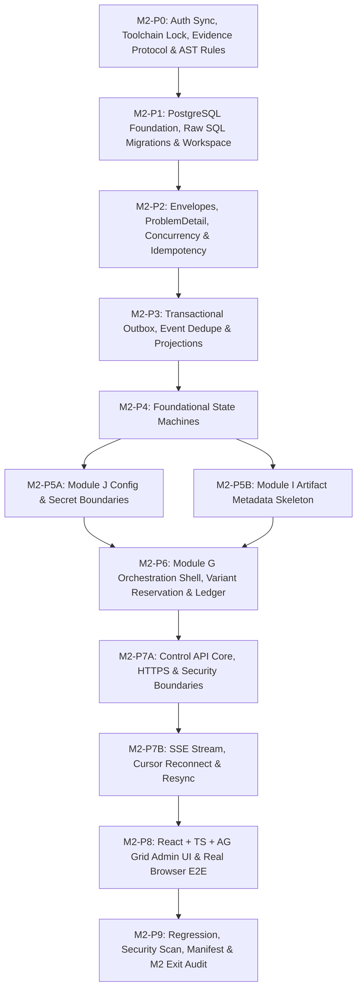

# M2 — Control Plane và Nền tảng Có thể Quan sát: Kế hoạch Thực thi (Implementation Plan)

**Tệp:** `docs/milestones/m2-control-plane/implementation-plan.md`  
**Trạng thái:** `M2-P1..P7B_ACCEPTED_CLOSED`; `M2-P8_CP1_ACCEPTED`; `CP2A_BACKEND_AUDIT_BLOCKED` (M1 live E3 thiếu credential); P8 chưa COMPLETE; P9 `LOCKED`.
**Ngày lập:** 13-09-2026 (User đã chấp thuận plan sau independent re-audit HEAD `5ba3a1601f0e1402e54a82feb5b44fe94cda9197`.)
**Điểm dừng bắt buộc hiện hành:** P1..P7B là `ACCEPTED / CLOSED`. P7A accepted source/tooling `6c3a52bde905ee5e71e12334da1873ed20f5c5db`, GREEN `run-m2-p7a-green-20260916224033` và Behavioral oracle SHA-256 `63151da21b07c3dd92c5b4a7acc0d4f952f188ee2425a52c9d3ac8d34eb61035` giữ bất biến; compatibility đúng thân P7A hardening H16 là ngoại lệ accepted trong P7B. P7B accepted source/tooling `c44214ad027986a0db7cb9d8e221590f232a0036`, GREEN `run-m2-p7b-green-20260917040648`, Behavioral oracle SHA-256 `d83d0f2d808f1b0067d5288ea131ded24d8fc46a16462b5254fd4167f7425738`; migration `0008` và ngoại lệ đúng thân P3 `append()` thuộc kết quả accepted. RED `run-m2-p7b-red-20260917002633` accepted; candidate GREEN `run-m2-p7b-green-20260917024918` giữ nguyên làm lịch sử bị từ chối. Không chạy lại evidence accepted cho docs-only closure.
Kích hoạt Phase 7 / M2-P8 Checkpoint 1 (CP1) ở trạng thái `AUTHORIZED_PREPARATION_RED` theo `D:\TU_CODE\agents-coworkers\docs\phase7-first-workload-plan.md`. Product checkout gốc read-only (INV-001); thực thi duy nhất trong AO-managed worktree riêng tại baseline `4a7c8c921b7e05066505d51b168a02c3fde61317`. Worker profile `gemini-3.8-flash-high/high`; thinkingLevel `NOT OBSERVED`. Amendment P8-START-001 được duyệt: operation SUCCEEDED nghĩa là StartProductionBatch chuyển batch CREATED→RUNNING bền vững; không phải video completion hay completion ledger; historical receipts trả `unknown_legacy`/revision `null`. Bảo tồn 3 P8 test identities. CP1 chỉ cho phép governance (6 files), blank scaffold, fixture HTTPS/trust/bootstrap, 3 browser UPSTREAM_PATH_RED tests, 1 backend RED test (missing revision=0). Tuyệt đối cấm migration 0009, cấm state writer, cấm test driver transition, cấm UI business GREEN, cấm production launcher, cấm commit/push. CP2 cần authority riêng sau audit CP1. P9 `LOCKED`, M3/Phân hệ A `NOT AUTHORIZED`.
Đoạn CP1 ngay trên ghi lại giới hạn lịch sử trước khi user duyệt CP2A, không cấm migration/backend CP2A hiện hành. CP2A dừng tại audit backend; live E3 của M1 chưa đủ điều kiện chạy nên chưa đóng audit hoặc mở UI GREEN.
**Căn cứ:**
- [Đặc tả Kỹ thuật M2](./spec.md)
- [Roadmap Mục 8 — M2 Control Plane](../../11-roadmap.md)
- Hợp đồng: [00-common-contract.md](../../09-contracts/00-common-contract.md), [01-control-api-and-stream.md](../../09-contracts/01-control-api-and-stream.md), [02-domain-events.md](../../09-contracts/02-domain-events.md), [09-orchestration-contracts.md](../../09-contracts/09-orchestration-contracts.md), [10-storage-contracts.md](../../09-contracts/10-storage-contracts.md), [11-configuration-security-contracts.md](../../09-contracts/11-configuration-security-contracts.md), [12-state-machines.md](../../09-contracts/12-state-machines.md)
- Chiến lược kiểm thử: [10-test-strategy.md](../../10-test-strategy.md)
- ADR liên quan: [ADR-0001](../../adr/0001-hybrid-modular-monolith.md), [ADR-0002](../../adr/0002-authoritative-data-and-search.md), [ADR-0004](../../adr/0004-commit-idempotency-and-fencing.md), [ADR-0007](../../adr/0007-runtime-and-admin-ui.md), [ADR-0009](../../adr/0009-trust-boundaries-and-secrets.md)

---

## 1. Nguyên tắc Thực thi Bắt buộc của M2

1. **Chu trình Kỷ luật Tuyệt đối**:
   `SPEC → PLAN → RED → IMPLEMENT → RUN → TEST → FIX → VERIFY → EVIDENCE → COMMIT`
2. **Kỷ luật Test-First Phân loại**:
   - **M2-P0** là package capability/preflight: Sử dụng compatibility PASS/FAIL evidence và architecture-validator AST tests. P0 tạo skeleton interfaces để P1+ fail vì oracle/NotImplemented chứ không fail vì missing module/import setup.
   - **Từ M2-P1 trở đi**: Bắt buộc chứng kiến RED thật đúng oracle nghiệp vụ, lưu stdout thô UTF-8 không BOM vào thư mục evidence của package trước khi viết code implementation.
3. **Bảo vệ Kiến trúc Modular Monolith & Domain Purity**:
   Mã nguồn M2 đặt trong `src/controlplane/`. Lớp Domain thuần túy tuyệt đối **không import** `fastapi`, `temporalio`, `psycopg`, `psycopg_pool`, `google` hay mã prototype `src/m1proof`. Bổ sung AST checker tự động thực thi luật import một chiều.
4. **Bảo toàn Hồi quy M1**:
   Toàn bộ **93 bài test của M1** phải tiếp tục đạt `PASS` (100% green, 0 skipped, 0 failed) trong suốt quá trình phát triển M2.
5. **Tooling & Scanner Độc lập**:
   M2 xây dựng tooling và secret scanner riêng (`src/controlplane/infrastructure/security/`), tuyệt đối không import hoặc phụ thuộc vào script `m1proof.oauth_broker`.
6. **Khóa Phiên bản Sau Nghiên cứu**:
   Lựa chọn exact pinned dependency trong P0 sau compatibility proof: FastAPI (>=0.135.0 cho native SSE), `psycopg_pool`, Node.js 22 LTS, npm exact, React, TypeScript, AG Grid Community maintained patch, Vite, Playwright TypeScript. Tuyệt đối không dùng `latest`.
7. **Không Mock trong E2E**:
   Kiểm thử E2E của M2 là dòng chảy thực bằng Playwright TypeScript: `Browser → FastAPI Control API → Application/UoW → PostgreSQL → Outbox → Projection → SSE → Browser DOM (AG Grid)`. Không dùng mock/fixture hard-coded trong frontend.
8. **Ranh giới Bảo mật Fail-Closed**:
   0 byte plaintext secret được lưu trong PostgreSQL nghiệp vụ hay trả về qua API/UI/Event/Log. Mọi vi phạm secret boundary lập tức kích hoạt STOP condition.
9. **Khóa chặt Phạm vi Ngoài M2**:
   Milestone M3 và Phân hệ A tiếp tục duy trì trạng thái **`NOT AUTHORIZED`**. Cấm triển khai bất kỳ mã nguồn nào của Module A..F trong M2.

---

## 2. Sơ đồ Chuỗi Work Packages M2



---

## 3. Chi tiết 12 Work Packages (Definition of Ready & Done)

---

### M2-P0: Authorization Sync, Toolchain Lock, Evidence Protocol & Architecture Rules

- **Requirement / CT / INV IDs**: `ARCH-001`, `ADR-0007`, `PCC-027`, `PCC-028`, `INV-001..012`.
- **Dependencies**: Không có (Khởi đầu M2).
- **Mục tiêu**:
  1. Xác nhận đồng bộ trạng thái authorization (M1 ACCEPTED, M2 AUTHORIZED, M3 NOT AUTHORIZED).
  2. Quyết định production packaging strategy cho `src/controlplane` trong `pyproject.toml` đảm bảo import/entrypoint hoạt động từ fresh documented environment mà không phụ thuộc test-only `sys.path` hacks và không làm hỏng M1 regression.
  3. Đánh giá compatibility và khóa chính xác backend candidates: `fastapi >= 0.135.0` (hỗ trợ native SSE), `uvicorn`, `psycopg_pool` (bắt buộc cho connection pooling), `httpx==0.28.1`.
  4. Lựa chọn và khóa chính xác frontend toolchain: Node.js 22 LTS, `npm` exact version, React, TypeScript, AG Grid Community maintained patch, Vite, Playwright TypeScript; khởi tạo `src/controlplane/ui/package.json` và lockfile exact.
  5. Thiết kế và kiểm thử công cụ Evidence Validator thực thi ngay từ P0: Định nghĩa schema `status.json` (nguồn sự thật duy nhất cho máy), cơ chế kiểm tra `hashes.sha256` DAG không tự tham chiếu (exclude itself), và quy tắc kiểm tra gate fail-closed.
  6. Xây dựng bộ kiểm thử Architecture/Import boundary bằng AST (`tests/m2/test_p0_architecture_rules.py`) cấm domain layer import bất kỳ framework/driver ngoài nào hoặc import mã M1 proof.
  7. Khởi tạo skeleton interfaces tối thiểu để các bài test của P1+ thất bại vì oracle nghiệp vụ / `NotImplementedError` thay vì `ModuleNotFoundError`.
- **Allowed File Scope**:
  - `pyproject.toml`, `uv.lock`
  - `src/controlplane/ui/package.json`, `package-lock.json`
  - `src/controlplane/ui/vite.config.ts`, `playwright.config.ts`
  - `docs/milestones/m2-control-plane/toolchain-lock.md`
  - `src/controlplane/infrastructure/evidence/**` (evidence validator script)
  - `src/controlplane/domain/interfaces/**` (skeleton interfaces)
  - `tests/m2/test_p0_architecture_rules.py`, `tests/m2/test_p0_evidence_validator.py`
  - `docs/milestones/m2-control-plane/evidence/m2-p0/**`
- **Forbidden File Scope**:
  - `src/m1proof/**` (cấm sửa)
  - `tests/m1/**` (cấm sửa)
  - `src/controlplane/domain/` (chỉ skeleton interfaces, chưa code domain models)
  - `src/controlplane/api/**`, `application/**` (chưa code ở P0)
- **RED Oracle / Preflight Protocol**:
  - P0 là preflight package: Không tạo RED giả do thiếu cài đặt thư viện.
  - `test_tst_m2_p0_001_ast_boundary_rules`: Cố tình quét module vi phạm import `fastapi` trong domain -> Thất bại đúng oracle của AST checker.
  - `test_tst_m2_p0_002_evidence_validator_rejects_tampered_hash`: Validator kiểm tra hash DAG không tự tham chiếu -> Thất bại đúng oracle khi tệp hash bị sửa.
- **Positive Tests**: AST boundary test xác nhận 100% domain code tuân thủ luật phụ thuộc một chiều; evidence validator kiểm tra hợp lệ thư mục P0; toàn bộ backend và frontend toolchain resolve thành công.
- **Negative Tests**: Chèn thử import `psycopg` vào domain interface -> Bị chặn ngay lập tức; tạo `status.json` sai schema -> Validator báo lỗi fail-closed.
- **Concurrency / Fault / Security Tests**: N/A cho P0.
- **Migration / Rollback**: N/A.
- **Evidence**:
  - `docs/milestones/m2-control-plane/evidence/m2-p0/commands.jsonl`
  - `docs/milestones/m2-control-plane/evidence/m2-p0/status.json` (machine-readable authority)
  - `docs/milestones/m2-control-plane/evidence/m2-p0/status.md` (human-readable derivative)
  - `docs/milestones/m2-control-plane/evidence/m2-p0/hashes.sha256` (loại trừ chính nó)
  - `docs/milestones/m2-control-plane/evidence/m2-p0/capability_toolchain.json`
  - `docs/milestones/m2-control-plane/toolchain-lock.md`
- **PASS Criteria**:
  - M1 regression: 93 passed, 0 skipped, 0 failed.
  - Backend và frontend toolchain được exact-pin và verify tương thích trên Python 3.13 và Node 22 LTS.
  - Evidence validator và AST checker hoạt động chuẩn xác, chứng minh domain purity.
- **STOP Condition**: Xảy ra xung đột dependency giữa `psycopg_pool`, `pydantic 2.13.5` và FastAPI trên Python 3.13, hoặc packaging strategy phá vỡ test suite M1.
- **Claim Allowed**: "M2-P0 hoàn tất: Toolchain đã khóa chính xác; evidence protocol và quy tắc kiến trúc domain purity đã sẵn sàng."
- **Claim Forbidden**: "Control plane đã sẵn sàng chạy" hoặc "Database đã migration".

---

### M2-P1: PostgreSQL Foundation, Raw SQL Migrations & Workspace/Identity/Session Foundation

- **Requirement / CT / INV IDs**: `ARCH-002`, `ADR-0002`, `QR-MNT-002`; `CT-API-001` **chỉ cho nền tảng persistence/binding theo workspace**; `CT-API-010` **chỉ cho nền tảng persistence AuthSession**. Không gán `CT-CMN-001`, `INV-001..003`, hoặc claim đầy đủ API/auth/Host/Origin/CSRF cho P1.
- **Machine-Readable Gate IDs (Chốt Trước RED)**:
  - `GATE-P1-01`: Migration Safety & Strict Ordering (regex discovery, version gap detection, missing applied file rejection, duplicate version rejection).
  - `GATE-P1-02`: Bounded Advisory Lock & Checksum Verification (`pg_try_advisory_lock` with monotonic deadline timeout, SHA-256 tamper rejection).
  - `GATE-P1-03`: UnitOfWork Atomic Transaction & Connection Cleanliness (single connection per UoW, atomicity across Workspace/Actor/AuthSession, clean rollback on exception, pool connection cleanliness).
  - `GATE-P1-04`: Workspace/Actor/AuthSession DB-Level Isolation & Invariants (server-side workspace binding, `UNIQUE (workspace_id, actor_id)`, composite foreign key on `cp_auth_sessions`, workspace-scoped repository methods, zero unscoped get_by_id).
  - `GATE-P1-05`: Milestone M1 Regression (đúng 93/93) & M2-P0 Regression (exact frozen accepted P0 testcase-name set gồm 33 case, architecture AST rules và P0 evidence validator), do chính P1 synthesis pipeline tạo artifact và semantic profile P1 kiểm tra.
  - `GATE-P1-06`: Security Scan Cleanliness & Deterministic Evidence Provenance (0 secret canary findings, 1:1 execution command records, SHA-256 DAG validity).
- **Dependencies**: M2-P0 (`ACCEPTED / CLOSED`).
- **Mục tiêu**:
  1. Hiện thực hóa Raw SQL Migration Runner native:
     - Dùng connection chuyên biệt và **session-level bounded advisory lock** (`pg_try_advisory_lock` kết hợp monotonic clock deadline timeout 5.0 giây, giải phóng qua `pg_advisory_unlock` trong khối `finally`). Khóa không bị giải phóng giữa các transaction con.
     - Bảng `controlplane.cp_schema_migrations` lưu `version`, `name`, `checksum_sha256`, `applied_at`, `execution_ms`.
     - Checksum verification & tamper detection: phát hiện sửa đổi tệp hoặc xóa tệp đã áp dụng khỏi đĩa -> fail-closed ngay lập tức.
     - Strict ordering & discovery regex: forward migration filename pattern `^\d{4}_[a-z0-9_]+\.sql$`, rollback pattern `^\d{4}_[a-z0-9_]+\.rollback\.sql$`. Runner discovery chỉ nhận tệp forward, ngăn chặn rollback file bị chạy nhầm thành migration.
     - Fail-closed khi có version gap hoặc duplicate version.
     - Transactional SQL only: Migration fail -> Transaction rollback, không ghi applied, startup fail-closed.
     - Forward migration từng file trong transaction riêng; commit sau khi cập nhật bảng migration tracking.
     - Rollback migration tương ứng; `0001` rollback đưa DB về trạng thái tiền-0001 và drop schema `controlplane` CASCADE.
     - **Disposable Test Database Protocol**: Kiểm thử chu trình rollback full down/up và integration tests **bắt buộc chạy trên disposable test database** độc lập. Fixture `disposable_db` có function scope: mỗi mandatory behavioral oracle tạo database `m2_p1_test_<uuid>` riêng, không tái sử dụng migration/applied state từ oracle trước.
       * Admin test DSN chỉ nạp từ `M2_TEST_PG_DSN`; tuyệt đối không hard-code, log, hay suy đoán credential trong source/docs/stdout/evidence. Không được có fallback local/dev-safe hoặc credential mặc định.
       * Thiếu DSN, không kết nối được server, hoặc không có quyền tạo database disposable là prerequisite `FAIL` hoặc `BLOCKED_EXTERNAL` theo evidence policy. Không được chuyển sang database khác hoặc tự đoán credential để tiếp tục.
       * Chạy migration production thật với schema cố định `controlplane` (không template hoặc thay thế schema name bên trong production SQL).
       * **Test bootstrap hẹp cho downstream oracle**: P1-005, P1-007 và P1-011 dùng fixture DDL test-only tạo object prerequisite trực tiếp trong disposable database function-scoped; fixture không gọi `MigrationRunner.migrate_up()`, không tạo/sửa production migration, và bị teardown cùng database. P1-006 là ngoại lệ bắt buộc: chạy `MigrationRunner` với production migration directory, apply production `0001`, rồi chứng minh composite FK bằng PostgreSQL `ForeignKeyViolation`.
       * **Migration rollback guard**: Rollback destructive chỉ chạy trên dedicated migration connection đang giữ advisory lock; `current_database()` của chính connection đó phải đúng expected fixture identity, tên khớp `^m2_p1_test_[0-9a-f]+$`, đồng thời marker môi trường kiểm thử hợp lệ (`is_test_env=True`) đã được xác nhận. Thiếu hoặc mismatch expected identity đều bị chặn. Cấm mọi nhánh tên tổng quát `*_test` và mọi `allow_destructive=True` free-form.
       * **Database teardown**: Đóng toàn bộ target pool/connections trước. Sau đó admin connection thực hiện `DROP DATABASE` chỉ với exact database name do fixture đã tạo, đã verify regex và identity. Admin connection không bắt buộc — và không được — có `current_database()` bằng target database, vì PostgreSQL không cho một session drop chính database nó đang sử dụng.
       * **Migration fault sandbox**: Fixture copy toàn bộ `src/controlplane/infrastructure/db/migrations/` vào temporary directory và cấu hình runner test trỏ tới bản copy. Mọi tamper/delete/add broken migration chỉ diễn ra trong sandbox; `finally` phải cleanup sandbox và kiểm tra source migration production giữ nguyên trước/sau test.
  2. Tạo migration `0001_initial_controlplane.sql` khởi tạo schema `controlplane`, bảng `cp_workspaces`, `cp_actors`, `cp_auth_sessions`.
     - Phân biệt rõ `AuthSession` (`cp_auth_sessions`) với `AppSession` (`cp_app_sessions` dành cho phiên mở desktop app data model: started_at, ended_at, output_folder, v.v. ở phase sau).
     - Ràng buộc DB-level invariants:
       * `cp_workspaces`: `workspace_id` UUID PRIMARY KEY, `name`, `status`, `created_at`, `updated_at`.
       * `cp_actors`: `actor_id` UUID, `workspace_id` UUID NOT NULL REFERENCES cp_workspaces(workspace_id) ON DELETE RESTRICT, `actor_type`, `display_name`, `status`, `created_at`, PRIMARY KEY (actor_id), `UNIQUE (workspace_id, actor_id)`.
       * `cp_auth_sessions`: `session_id` UUID PRIMARY KEY, `workspace_id` UUID NOT NULL, `actor_id` UUID NOT NULL, `status`, `created_at`, `expires_at`, composite FK `FOREIGN KEY (workspace_id, actor_id) REFERENCES controlplane.cp_actors(workspace_id, actor_id) ON DELETE RESTRICT`. Không thêm `token_hash`: token/cookie/credential binding cụ thể thuộc M2-P7A.
       * Composite FK ngăn chặn cross-workspace session ở tầng DB schema.
  3. Xây dựng `SqlUnitOfWork` và `TransactionManager`:
     - `SqlUnitOfWork` sở hữu đúng **một pooled connection** và **một DB transaction** trong mỗi UoW scope.
     - Repository nhận connection của UoW, không tự acquire pool connection, không tự commit/rollback.
     - `TransactionManager` chỉ đóng vai trò UoW factory/coordinator, không phải transaction owner thứ hai.
  4. Repository & Workspace Isolation:
     - Cung cấp: `IWorkspaceRepository`, `IActorRepository`, `IAuthSessionRepository` và Postgres implementations.
     - Mọi owned entity bắt buộc bind workspace server-side.
     - Tuyệt đối không expose unscoped `get_by_id(id)` cho actor/session business access; bắt buộc dùng workspace-scoped context: `get_by_id(workspace_id, entity_id)`.
     - Ports chỉ gồm use case nền tảng create/get/list/update status; `AuthSession` thêm revoke/expire. Không cung cấp generic hard-delete cho `Workspace`/`Actor`, không dùng cascade mặc định; lifecycle dùng status/revoke/expire cho đến khi có contract khác.
     - Application service (nếu có) chỉ nhận injected UoW/`TransactionManager` factory; không sở hữu raw DSN hay tự mở connection. Persistence Workspace/Actor/AuthSession phải đi qua repository dùng connection do `SqlUnitOfWork` sở hữu.
  5. Evidence Infrastructure Extension:
     - Bổ sung `profile_p1.py` và `synthesizer_p1.py`.
     - `M2P1SemanticProfile` implement đúng extension contract `PackageSemanticProfile`: `profile_id -> "m2-p1"`, `target_package -> "M2-P1"`, `evaluate(package_dir, status_data)`. Không định nghĩa hoặc dùng `package_id` hay `target_gate_id = "GATE-P1-ALL"`.
     - Semantic registry là process-local. `synthesizer_p1.py` phải hỗ trợ synthesis mode và `--verify-only`; **cả hai mode** explicit gọi `register_semantic_profile(M2P1SemanticProfile())` trước khi gọi validator core. Final read-only verification bắt buộc chạy P1-aware verifier `synthesizer_p1.py --verify-only`, không chạy generic `python -m controlplane.infrastructure.evidence.validator .../m2-p1` trong process mới.
     - Không đưa live evidence test vào `m2-p1-tests.xml` để tránh chu trình tự tham chiếu.
      - P1 synthesis phải preflight runtime trong locked Controlplane environment, tạo và profile P1 trực tiếp parse `m2-p1-tests.xml`, `m2-p0-regression.xml`, `m2-p0-regression-report.txt`, `m1-regression.xml`, `m1-regression-report.txt`, `runtime-capability.json`, `secret-scan.json`, `commands.jsonl`, `status.json` và `hashes.sha256`. P1 chạy bằng `src/controlplane/requirements.lock`/`uv.lock`; P0/M1 regression chạy bằng root frozen M1 environment, cùng một `run_id` và provenance rõ interpreter. Không được chạy P0 regression bên ngoài pipeline rồi tự ghi `GATE-P1-05: PASS`.
      - `m2-p0-regression.xml` phải được sinh từ đúng ba source suite frozen `tests/m2/test_p0_architecture_rules.py`, `tests/m2/test_p0_evidence_validator.py`, `tests/m2/test_p0_packaging.py`. Profile P1 normalize JUnit testcase identity theo `test-file::testcase-name`, đòi tập identity bằng **đúng** accepted set 33 case dưới đây và 0 failed/error/skipped; thiếu, thay tên, chạy subset hoặc có case ngoài set đều làm `GATE-P1-05` FAIL.
- **Allowed File Scope**:
  - `src/controlplane/infrastructure/db/**`
  - `src/controlplane/domain/identity/**`
  - `src/controlplane/application/identity/**`
  - `src/controlplane/infrastructure/evidence/profile_p1.py`
  - `src/controlplane/infrastructure/evidence/synthesizer_p1.py`
  - `src/controlplane/pyproject.toml` (chỉ bổ sung package/data inclusion để wheel chứa implementation P1; không đổi dependency/version lock)
  - `tests/m2/test_p1_db_and_workspace.py`
  - `docs/milestones/m2-control-plane/evidence/m2-p1/**`
- **Forbidden File Scope**:
  - `src/controlplane/infrastructure/evidence/evaluator.py` (cấm sửa)
  - `src/controlplane/infrastructure/evidence/validator.py` (cấm sửa)
  - `src/controlplane/infrastructure/evidence/profile_p0.py` (cấm sửa)
  - `src/controlplane/api/**`, `src/controlplane/ui/**`, `src/m1proof/**`, `tests/m1/**`.
- **RED Oracle**:
  - `test_tst_m2_p1_001_migration_forward_and_rollback_on_disposable_db`: Chạy chu trình up/down/up trên disposable test database `m2_p1_test_<uuid>` -> FAILED vì migration runner chưa có logic.
  - `test_tst_m2_p1_002_migration_checksum_tamper_rejected`: Sửa đổi 1 byte migration trong migration sandbox -> FAILED vì chưa có logic verify SHA-256 checksum.
  - `test_tst_m2_p1_003_migration_version_gap_and_duplicate_rejected`: Runner gặp version gap hoặc trùng lặp version -> FAILED vì chưa có gap/duplicate validation.
  - `test_tst_m2_p1_004_bounded_advisory_lock_and_timeout`: Runner 2 cố chạy khi Runner 1 giữ advisory lock -> FAILED vì chưa có bounded monotonic timeout acquisition.
  - `test_tst_m2_p1_005_uow_transaction_atomicity_and_rollback`: Bootstrap test-only bảng prerequisite; UoW #1 commit đủ Workspace/Actor/AuthSession và DB xác nhận cả ba; UoW #2 tạo bộ khác rồi raise phải rollback toàn bộ trong khi baseline committed giữ nguyên -> FAILED vì UoW/repository chưa implement transaction boundary, không fail ở migration runner.
  - `test_tst_m2_p1_006_workspace_isolation_and_composite_fk_enforcement`: Chạy production `MigrationRunner.migrate_up()` trên disposable DB, seed Workspace A/B + Actor A, rồi insert AuthSession (Workspace B, Actor A) phải ném PostgreSQL `ForeignKeyViolation` do production composite FK.
  - `test_tst_m2_p1_007_cross_workspace_read_and_status_mutation_prevented`: Direct-SQL seed Workspace A/B, Actor B và AuthSession B trong bootstrap test-only; bắt đầu tại scoped get/list/update/revoke/expire, rồi B-context xác nhận foreign data vẫn nguyên vẹn -> FAILED vì workspace-scoping behavior chưa implement, không fail ở migration runner.
  - `test_tst_m2_p1_008_destructive_guard_rejects_non_test_db`: Guard phải từ chối non-test name, `is_test_env=False`, valid-shaped name khác expected identity và thiếu expected identity; chỉ exact fixture identity + `is_test_env=True` được phép.
   - `test_tst_m2_p1_009_applied_migration_file_missing_rejected`: Apply migration trong sandbox rồi xóa chính forward file của sandbox -> FAILED vì runner chưa fail-closed với `MigrationMissingFileError`.
   - `test_tst_m2_p1_010_sql_migration_failure_rolls_back_without_applied_record`: Migration sandbox tạo `cp_rollback_probe` rồi SQL lỗi; probe phải bị rollback và tracking chỉ còn version 1, không có applied record version 2.
   - `test_tst_m2_p1_011_uow_rollback_returns_clean_connection_to_pool`: Bootstrap test-only schema, ép UoW rollback trong pool `max_size=1`, ghi PostgreSQL backend PID, rồi mượn lại đúng PID đó ở trạng thái IDLE và chạy query/transaction mới -> FAILED vì `TransactionManager`/UoW/pool behavior chưa implement, không fail ở migration runner.
- **Tập Mandatory Behavioral Oracle (khóa trước RED)**:
  - `tests/m2/test_p1_db_and_workspace.py` phải định nghĩa đúng đủ 11 testcase: `test_tst_m2_p1_001_migration_forward_and_rollback_on_disposable_db`, `test_tst_m2_p1_002_migration_checksum_tamper_rejected`, `test_tst_m2_p1_003_migration_version_gap_and_duplicate_rejected`, `test_tst_m2_p1_004_bounded_advisory_lock_and_timeout`, `test_tst_m2_p1_005_uow_transaction_atomicity_and_rollback`, `test_tst_m2_p1_006_workspace_isolation_and_composite_fk_enforcement`, `test_tst_m2_p1_007_cross_workspace_read_and_status_mutation_prevented`, `test_tst_m2_p1_008_destructive_guard_rejects_non_test_db`, `test_tst_m2_p1_009_applied_migration_file_missing_rejected`, `test_tst_m2_p1_010_sql_migration_failure_rolls_back_without_applied_record`, `test_tst_m2_p1_011_uow_rollback_returns_clean_connection_to_pool`.
  - `M2P1SemanticProfile.evaluate(package_dir, status_data)` phải parse trực tiếp JUnit và report artifacts, xác minh từng mandatory testcase xuất hiện đúng một lần trong `m2-p1-tests.xml`, không skipped, không failed/error. Profile phải fail-closed khi thiếu bất kỳ testcase nào; một subset test xanh không thể chứng minh toàn bộ sáu gate.
  - Chuẩn metric trong `status.json` phải khớp JUnit thực tế cho P1, P0 regression và M1 regression (total/passed/failed/errors/skipped). Profile phải fail-closed khi P0 regression không PASS, M1 không đúng 93/93, secret scan không CLEAN/0 findings, hoặc provenance của run/commands/artifacts/hash DAG không khớp.
  - Trước khi chạy Behavioral RED, được phép chỉ tạo structural stub importable tối thiểu trong Allowed File Scope để import không ném `ModuleNotFoundError`; mọi constructor/method chưa hiện thực phải ném `NotImplementedError`. RED chỉ hợp lệ khi fail do oracle nghiệp vụ đã xác định, không phải setup/import thiếu.
- **Bảng Traceability cho 11 Mandatory Behavioral Oracles**:

  | Testcase | Technical source ID tối thiểu | Phạm vi traceability |
  |---|---|---|
  | `test_tst_m2_p1_001_migration_forward_and_rollback_on_disposable_db` | `ARCH-002`, `ADR-0002`, `QR-MNT-002` | PostgreSQL foundation, migration up/down và disposable database. |
  | `test_tst_m2_p1_002_migration_checksum_tamper_rejected` | `ADR-0002`, `QR-MNT-002` | Checksum/tamper fail-closed trong migration sandbox. |
  | `test_tst_m2_p1_003_migration_version_gap_and_duplicate_rejected` | `ADR-0002`, `QR-MNT-002` | Discovery strict ordering và fail-closed. |
  | `test_tst_m2_p1_004_bounded_advisory_lock_and_timeout` | `ADR-0002`, `QR-MNT-002` | Bounded advisory lock cho migration runner. |
  | `test_tst_m2_p1_005_uow_transaction_atomicity_and_rollback` | `ARCH-002`, `QR-MNT-002` | Transaction boundary/UoW atomicity. |
  | `test_tst_m2_p1_006_workspace_isolation_and_composite_fk_enforcement` | `ADR-0002`, `CT-API-001` (workspace persistence/binding foundation only) | DB-level workspace binding. |
  | `test_tst_m2_p1_007_cross_workspace_read_and_status_mutation_prevented` | `CT-API-001` (workspace persistence/binding foundation only), `CT-API-010` (AuthSession persistence foundation only), `ADR-0009` | Scoped get/list/status mutation và AuthSession revoke/expire. |
  | `test_tst_m2_p1_008_destructive_guard_rejects_non_test_db` | `ADR-0002`, `QR-MNT-002` | Destructive migration rollback chỉ trên fixture identity hợp lệ. |
  | `test_tst_m2_p1_009_applied_migration_file_missing_rejected` | `ADR-0002`, `QR-MNT-002` | Applied-file-missing fail-closed trong migration sandbox. |
  | `test_tst_m2_p1_010_sql_migration_failure_rolls_back_without_applied_record` | `ADR-0002`, `QR-MNT-002` | SQL failure rollback và không có applied record trong migration sandbox. |
  | `test_tst_m2_p1_011_uow_rollback_returns_clean_connection_to_pool` | `ARCH-002`, `QR-MNT-002` | Pool connection clean sau UoW rollback. |

- **Frozen Accepted M2-P0 Testcase Identity (33; exact set)**:

  - `tests/m2/test_p0_architecture_rules.py`: `test_tst_m2_p0_001_ast_boundary_rules_clean_codebase`, `test_tst_m2_p0_001_domain_rejects_fastapi_import`, `test_tst_m2_p0_001_domain_rejects_psycopg_import`, `test_tst_m2_p0_001_rejects_m1proof_prototype_import`, `test_tst_m2_p0_001_rejects_src_m1proof_prefix_import`, `test_tst_m2_p0_001_domain_rejects_outer_layer_import`.
  - `tests/m2/test_p0_evidence_validator.py`: `test_tst_m2_p0_002_evidence_validator_accepts_valid_package`, `test_tst_m2_p0_002_evidence_validator_rejects_tampered_hash`, `test_tst_m2_p0_002_evidence_validator_rejects_self_referential_hash`, `test_tst_m2_p0_002_evidence_validator_rejects_schema_mismatch`, `test_tst_m2_p0_002_evidence_validator_rejects_failing_gate_with_pass_status`, `test_tst_m2_p0_002_evidence_validator_rejects_untracked_extra_file`, `test_tst_m2_p0_002_semantic_evaluator_rejects_junit_failures`, `test_tst_m2_p0_002_semantic_evaluator_rejects_skipped_tests`, `test_tst_m2_p0_002_semantic_evaluator_rejects_m1_count_mismatch`, `test_tst_m2_p0_002_semantic_evaluator_rejects_dirty_secret_scan`, `test_tst_m2_p0_002_semantic_evaluator_rejects_failed_txt_reports`, `test_tst_m2_p0_002_live_p0_evidence_is_valid`, `test_tst_m2_p0_002_semantic_evaluator_rejects_unknown_package_or_profile`, `test_tst_m2_p0_002_semantic_evaluator_dispatches_registered_p1_sample_profile`, `test_tst_m2_p0_002_semantic_evaluator_blocks_cross_package_profile_spoofing`, `test_tst_m2_p0_002_semantic_evaluator_rejects_provenance_run_id_mismatch`, `test_tst_m2_p0_002_semantic_evaluator_rejects_provenance_timestamp_drift`, `test_tst_m2_p0_002_semantic_evaluator_rejects_missing_run_id_in_status`.
  - `tests/m2/test_p0_packaging.py`: `test_tst_m2_p0_003_controlplane_import_without_syspath_hack`, `test_tst_m2_p0_003_no_syspath_hacks_in_controlplane_source`, `test_tst_m2_p0_003_pyproject_and_build_lock_metadata`, `test_tst_m2_p0_003_backend_dependency_graph_and_build_lock`, `test_tst_m2_p0_003_frozen_project_environment_install`, `test_tst_m2_p0_003_fresh_environment_wheel_build_and_install`, `test_tst_m2_p0_003_frozen_install_rejects_mutated_lock_mismatch`, `test_tst_m2_p0_004_frontend_toolchain_exact_pins_and_runtime_manifest`, `test_tst_m2_p0_005_skeleton_interfaces_raise_not_implemented`.
- **Positive Tests**:
  - Migration chạy tiến thành công trên PostgreSQL container qua disposable test database.
  - Connection pool cấp phát kết nối ổn định.
  - UoW atomic commit: Workspace, Actor, AuthSession được commit cùng nhau.
  - Workspace-scoped repository trả đúng dữ liệu của workspace được chỉ định.
- **Negative Tests**:
  - Sửa đổi checksum file đã migrate -> Fail-closed `MigrationChecksumMismatchError`.
  - Tệp migration trên đĩa bị xóa sau khi apply -> Fail-closed `MigrationMissingFileError`.
  - Version gap (0001, 0003) -> Fail-closed `MigrationVersionGapError`.
  - Tên tệp duplicate version -> Fail-closed `DuplicateMigrationVersionError`.
  - Lỗi SQL giữa chừng -> Transaction rollback sạch sẽ toàn bộ side effect, không ghi nhận bản ghi vào `cp_schema_migrations`.
  - Cố tình chạy destructive rollback trên non-test DB hoặc thiếu cờ `is_test_env=True` -> Ném `DestructiveOperationBlockedError`.
  - Tạo auth session với actor_id thuộc workspace khác -> Bị PostgreSQL composite FK chặn ngay lập tức (`ForeignKeyViolation`).
  - Get/list hoặc update status thực thể khác workspace, hay revoke/expire AuthSession khác workspace qua scoped repository -> Trả về `None` hoặc raise `EntityNotFoundError`, không lộ dữ liệu cross-workspace. P1 không thêm delete port chỉ để phục vụ kiểm thử.
- **Concurrency / Fault / Security Tests**:
  - Concurrent migration runner: Runner 2 chờ runner 1, timeout sau bounded deadline (5s) và ném `MigrationLockTimeoutError`.
  - Tiến trình bị ngắt đột ngột: Connection đóng tự động giải phóng session-level advisory lock và rollback transaction.
  - Connection pool cleanliness: Sau rollback hoặc commit, connection trả về pool ở trạng thái idle sạch, không còn transaction open/aborted; borrower tiếp theo thực thi query và transaction mới được.
  - Quét secret fail-closed: 0 canary token/secret credentials trong migration logs hoặc DB schema.
- **Migration / Rollback**:
  - `0001_initial_controlplane.sql` (tạo schema `controlplane`, bảng `cp_schema_migrations`, `cp_workspaces`, `cp_actors`, `cp_auth_sessions`).
  - `0001_initial_controlplane.rollback.sql` (drop toàn bộ bảng, drop schema `controlplane` CASCADE để đưa disposable DB về trạng thái tiền-0001).
- **Evidence Protocol**:
  - Thư mục bằng chứng: `docs/milestones/m2-control-plane/evidence/m2-p1/` (`commands.jsonl`, `status.json`, `status.md`, `red-observations.md`, `red-p1-collect-stdout.txt`, `red-p1-prerequisite-stdout.txt`, `red-p1-stdout.txt`, `red-p1-runtime-<run-id>-prerequisite-stdout.txt`, `red-p1-runtime-<run-id>-collect-stdout.txt`, `red-p1-runtime-<run-id>-stdout.txt`, `hashes.sha256`, `m2-p1-tests.xml`, `m2-p1-tests-report.txt`, `m2-p0-regression.xml`, `m2-p0-regression-report.txt`, `m1-regression.xml`, `m1-regression-report.txt`, `runtime-capability.json`, `secret-scan.json`).
  - Không đưa test live package evidence vào `m2-p1-tests.xml` để tránh chu trình tự tham chiếu.
  - Flow: behavioral RED hợp lệ → implementation → locked runtime capability preflight → P1 GREEN suite (`m2-p1-tests.xml`, `m2-p1-tests-report.txt`) → same-run `runtime-capability.json` (PostgreSQL 18.6, CREATEDB, orphan DB 0) → frozen M2-P0 regression (`m2-p0-regression.xml`, `m2-p0-regression-report.txt`) → M1 regression (`m1-regression.xml`, `m1-regression-report.txt`) → final secret scan (`secret-scan.json`) → synthesize P1 evidence (`synthesizer_p1.py`) → final read-only P1-aware verification (`synthesizer_p1.py --verify-only`).
  - `red-p1-collect-stdout.txt` là raw output chứng minh exact set 11 test; `red-p1-prerequisite-stdout.txt` là raw prerequisite/`BLOCKED_EXTERNAL` output. Mỗi RED run trên PostgreSQL phải lưu raw prerequisite, collection và full run riêng theo `red-p1-runtime-<run-id>-{prerequisite,collect,stdout}.txt` trước mọi human interpretation. Các file RED raw được hash và lưu historical evidence, không bị semantic profile hiểu nhầm là failed test hiện tại.
  - `profile_p1.py` định nghĩa `M2P1SemanticProfile` theo exact extension contract, kiểm tra mandatory P1 oracles, exact frozen accepted P0 testcase-name set (33; thiếu bất kỳ identity nào là FAIL), M1 93/93, locked `runtime-capability.json`, secret scan 0 findings, status/JUnit consistency và provenance/hash DAG. Registry registration chỉ có hiệu lực trong process hiện tại.
- **PASS Criteria**:
  - P1-aware final read-only verifier (`synthesizer_p1.py --verify-only`) chạy trong locked Controlplane environment, đăng ký profile P1 rồi gọi validator core và đạt `VALIDATION: PASS`.
  - M1 regression: 93 passed, 0 skipped, 0 failed.
  - Frozen M2-P0 regression: exact accepted testcase-name set 33/33, 0 failed/error/skipped; artifact XML/report được sinh trong cùng P1 synthesis pipeline.
  - P1 tests: đủ 11 mandatory behavioral oracles, 100% passed (tất cả các bài test positive, negative, concurrency, UoW, DB invariants đều GREEN).
  - Secret scan: 0 findings.
  - Runtime capability cùng run: Python 3.13.15, psycopg 3.3.5, psycopg-pool 3.3.1 (`psycopg_pool.ConnectionPool`), PostgreSQL 18.6, CREATEDB=true, disposable DB orphan count=0.
  - 1:1 execution command records trong `commands.jsonl` khớp hoàn toàn SHA-256 và timestamp.
- **STOP Condition**:
  - Advisory lock bị giải phóng giữa các migration trong cùng một phiên chạy.
  - Rollback migration để lại bảng hoặc schema mồ côi trên disposable DB.
  - Database cho phép tạo session gắn với actor khác workspace (composite FK vi phạm hoặc thiếu).
  - Bất kỳ bài test nào của M1 bị fail.
  - P0 regression không PASS, bất kỳ mandatory P1 oracle nào thiếu/skipped/failed/error, profile P1 không được đăng ký trong final verifier, hoặc provenance/status/JUnit/hash DAG mismatch.
- **Claim Allowed**: "M2-P1 hoàn tất: PostgreSQL migration engine đạt 8 tiêu chuẩn, UnitOfWork atomic transaction, Workspace/Actor/AuthSession isolation với DB-level invariants đã được kiểm chứng."
- **Claim Forbidden**: "Control API đã sẵn sàng" hoặc "M2-P2 đã được mở."

---

### M2-P2: Envelopes, RFC 9457 ProblemDetail, Optimistic Concurrency & Durable Idempotency

- **Authorization / checkpoint hiện hành:** P2 implementation correction đã hoàn tất; checkpoint dừng tại `M2-P2_IMPLEMENTATION_READY_FOR_REVIEW` để independent audit. **Cấm** mở P3/M3/Module A hoặc tự đặt ACCEPTED/CLOSED.
- **Requirement / contract IDs**: `CT-CMN-001` (MessageEnvelope), `CT-CMN-002` (CommandEnvelope), `CT-CMN-003` (CommandReceipt), `CT-CMN-005` (RevisionedResource), `CT-CMN-006` (TimestampPolicy), `CT-CMN-010` (ProblemDetail), `CT-CMN-011` (IdempotencyPolicy), `CT-API-001` **chỉ** cho nền tảng idempotency/`expected_revision`/conflict semantics trước HTTP boundary, và `ADR-0004` cho durable receipt/idempotency/commit semantics. Không thuộc P2: `CT-CMN-004` (QueryPage), FastAPI/API mapping, `ADR-0005`, `ADR-0010`, outbox hoặc state machine.
- **Dependencies**: M2-P1.
- **Mục tiêu**:
  1. Hiện thực hóa `MessageEnvelope`/`CommandEnvelope` theo matrix khóa: unconditional `contract_name`, `contract_version`, `message_id`, `workspace_id`, `correlation_id`, `occurred_at`, `actor`, `payload`, `command_id`, `requested_at`; `causation_id` chỉ với message phát sinh; `trace_context` chỉ khi qua process boundary; `recovery_epoch` chỉ message nội bộ có mutation/side effect; `idempotency_key` chỉ ở external boundary; `expected_revision` chỉ update aggregate đã có; `policy_revision_id` chỉ khi hành vi phụ thuộc policy. `occurred_at`/`requested_at` là UTC RFC 3339 theo `CT-CMN-001/002/006`.
  2. Hiện thực hóa `ProblemDetail` transport-neutral theo `CT-CMN-010`. Required, non-null: `type` (URI), `title`, `detail` (safe Vietnamese user text), `instance`, `code`, `category`, `retryable`, `correlation_id`. Optional/nullable: `status` (chỉ integer HTTP status khi HTTP adapter sau này gán), `retry_after`, `field_errors`, `technical_detail_ref`. `field_errors` là collection lỗi field an toàn hoặc null; `technical_detail_ref` là opaque safe reference hoặc null, không stack trace/raw internal detail/secret. Không có FastAPI middleware hay HTTP mapper ở P2.
  3. Tạo migration production `0002_idempotency_and_receipts.sql` và `0002_idempotency_and_receipts.rollback.sql`. `cp_command_receipts` có `receipt_id` PK, `workspace_id` NOT NULL FK P1 workspace, `command_id` NOT NULL, `disposition` (`accepted` hoặc `rejected`; không dùng `duplicate` làm durable receipt), `operation_id` nullable, `resource_ref` nullable JSONB, `accepted_at` NOT NULL UTC, `current_revision` nullable; unique `(workspace_id, command_id)`. `cp_idempotency_records` có PK `(workspace_id, command_name, idempotency_key)`, `request_hash` NOT NULL SHA-256, `receipt_id` NOT NULL FK `cp_command_receipts(receipt_id)`, `created_at` NOT NULL UTC, `expires_at` nullable. FK receipt phải cùng `workspace_id` bằng composite unique `(workspace_id, receipt_id)` ở receipt và composite FK ở record. Rollback chỉ drop hai P2 tables/constraints, không đụng schema hay objects P1.
  4. Khóa identity hash bằng **RFC 8785 JSON Canonicalization Scheme (JCS)** duy nhất: input parse thành I-JSON, serialize JCS bytes UTF-8. Property name được sort raw/unescaped, chuyển thành array UTF-16 code units và so sánh lexicographic ascending bằng unsigned UTF-16 code-unit, độc lập locale; sort đệ quy mọi object, gồm object nằm trong array. Array giữ nguyên element order. String escaping/Unicode theo ECMAScript/JCS (Unicode giữ nguyên, không normalization), `null`/boolean theo literal JSON, số theo ECMAScript IEEE-754 JCS representation. NaN/Infinity bị reject; negative zero theo JCS/ECMAScript canonicalize thành `0`. Logical object gồm `workspace_id`, `command_name`, `payload` canonical, `expected_revision` khi command mutation revisioned và `policy_revision_id` khi có. Loại trừ `message_id`, `command_id`, correlation/causation IDs và timestamps; SHA-256 chạy trên exact JCS UTF-8 bytes, không hash raw JSON.
  5. Cùng `(workspace_id, command_name, idempotency_key)` và cùng canonical hash luôn trả **cùng persisted receipt** (`receipt_id`, `operation_id`, `resource_ref`, `current_revision`) và cùng logical result. Persisted receipt chỉ `accepted`/`rejected`, không tạo mới hay mutate do replay; application result báo `disposition=duplicate` transiently cho caller replay. Không có claim operation/resource side effect owner ở P2: concurrency chỉ chứng minh một durable idempotency record, một durable receipt và same logical receipt/result. Hash khác trả `IDEMPOTENCY_KEY_REUSED_WITH_DIFFERENT_PAYLOAD`; workspace khác độc lập. Record không auto-purge trong M2 và restart không reset state.
  6. Nền optimistic concurrency production: domain/application `RevisionedMutationPort` gọi PostgreSQL CAS adapter tại `src/controlplane/infrastructure/db/concurrency/**`, dùng connection của P1 `SqlUnitOfWork`. Adapter thao tác disposable aggregate probe relation: create revision 1; `UPDATE ... SET revision = revision + 1 ... WHERE id = :id AND revision = :expected_revision` atomically. Zero row từ stale update đọc current revision trong cùng UoW rồi ném `RevisionConflictError(current_revision=...)`; rollback không tăng revision; hai writer cùng expected revision có đúng một commit. Không thêm aggregate nghiệp vụ; mapping HTTP 409 thuộc P7/API.
- **Allowed File Scope**:
  - `src/controlplane/domain/common/**`
  - `src/controlplane/application/ports/**`
  - `src/controlplane/infrastructure/db/migrations/0002_idempotency_and_receipts.*`
  - `src/controlplane/application/idempotency/**`
  - `src/controlplane/application/concurrency/**`
  - `src/controlplane/infrastructure/db/concurrency/**`
  - `src/controlplane/infrastructure/db/idempotency/**`
  - `src/controlplane/infrastructure/evidence/profile_p2.py`, `src/controlplane/infrastructure/evidence/synthesizer_p2.py`
  - `tests/m2/test_p2_envelopes_and_idempotency.py`
  - `docs/milestones/m2-control-plane/evidence/m2-p2/**`
- **Forbidden File Scope**:
  - `src/controlplane/api/**`, `src/controlplane/ui/**`, `src/m1proof/**`, `src/controlplane/infrastructure/db/migrations/0001_*`.
- **Port/adapter boundary**: domain/common chỉ giữ model/error; application coordinator chỉ gọi injected repository/UoW ports; PostgreSQL adapter dùng đúng connection do `SqlUnitOfWork` P1 sở hữu. Repository không tự acquire pool, commit hay rollback.
- **Mandatory Behavioral RED catalogue (exact, locked before RED)**:

| Testcase | Traceability | Expected RED riêng |
|---|---|---|
| `test_tst_m2_p2_001_envelope_required_fields_and_rfc3339_utc` | `CT-CMN-001`, `CT-CMN-002`, `CT-CMN-006` | Matrix unconditional/conditional đã khóa không được enforce, hoặc timestamp không UTC/RFC 3339 chưa bị từ chối. |
| `test_tst_m2_p2_002_problem_detail_transport_neutral_safe_contract` | `CT-CMN-010` | Thiếu/sai required `type/title/detail/instance/code/category/retryable/correlation_id`, nullable fields xử lý sai, `status` bị bắt buộc/HTTP-bound, hoặc lộ stack/secret/technical detail. |
| `test_tst_m2_p2_003_durable_command_receipt_persistence` | `CT-CMN-003`, `ADR-0004` | Command accepted chưa tạo receipt durable đúng workspace. |
| `test_tst_m2_p2_004_same_key_same_canonical_payload_replays_same_receipt` | `CT-CMN-011`, `ADR-0004` | Fixed JCS vectors (key/whitespace/nested/array/Unicode/numeric supported domain) không cho exact canonical bytes/SHA-256, hoặc replay không trả same persisted receipt với `duplicate` transient. Vector property-sort theo RFC 8785 dùng raw input A `{ "":"bmp", "𐀀":"nonbmp", "z":{"":0,"𐀀":1}, "array":[{"":"x","𐀀":"y"}] }` và input B `{"array":[{"":"x","𐀀":"y"}],"z":{"":0,"𐀀":1},"":"bmp","𐀀":"nonbmp"}`. Keys gồm `U+E000` và non-BMP `U+10000`; expected canonical UTF-8 text là `{"array":[{"𐀀":"y","":"x"}],"z":{"𐀀":1,"":0},"𐀀":"nonbmp","":"bmp"}`, exact bytes hex `7b226172726179223a5b7b22f0908080223a2279222c22ee8080223a2278227d5d2c227a223a7b22f0908080223a312c22ee8080223a307d2c22f0908080223a226e6f6e626d70222c22ee8080223a22626d70227d`, SHA-256 `26ba19fb0f713fb75a3113fbfb9bc2617149606043eb5958991b68ce4d175afb`. Different input order/whitespace phải cùng bytes/hash; naive Python `sorted(keys)` theo Unicode code points không được PASS. |
| `test_tst_m2_p2_005_same_key_different_payload_rejected` | `CT-CMN-011`, `CT-CMN-003` | Hash logic khác không trả `IDEMPOTENCY_KEY_REUSED_WITH_DIFFERENT_PAYLOAD`. |
| `test_tst_m2_p2_006_concurrent_same_key_same_payload_one_logical_receipt` | `CT-CMN-011`, `ADR-0004` | Hai transaction thật cùng request tạo hơn một durable receipt/idempotency record hoặc không cùng logical receipt/result. |
| `test_tst_m2_p2_007_concurrent_same_key_different_payload_rejects_loser` | `CT-CMN-011`, `ADR-0004` | Race cho hai payload không quy về một durable receipt/record và một reject. |
| `test_tst_m2_p2_008_workspace_scoped_idempotency_isolation_and_restart` | `CT-CMN-011`, `CT-API-001` (foundation only) | Cùng key ở hai workspace collision/cross-leak hoặc restart mất durable state. |
| `test_tst_m2_p2_009_successful_revision_update_increments_exactly_once` | `CT-CMN-005`, `CT-API-001` (foundation only) | PostgreSQL CAS probe matching update không tăng chính xác một lần, rollback làm đổi revision, hoặc race hai writer cùng expected revision có khác đúng một commit. |
| `test_tst_m2_p2_010_stale_revision_conflict_zero_mutation_and_current_revision` | `CT-CMN-005`, `CT-API-001` (foundation only) | Stale PostgreSQL CAS không trả `RevisionConflictError(current_revision=...)` hoặc làm mutation. |
| `test_tst_m2_p2_011_production_0002_forward_rollback_and_constraints` | `CT-CMN-003`, `CT-CMN-011`, `ADR-0004` | Migration production thiếu schema/unique/composite FK hoặc rollback đụng P1 objects. |

- **DB-oracle discipline**: P2 durability/concurrency/migration tests chạy PostgreSQL 18.6 disposable database thật qua P1 migration runner/UoW; không mock repository. Mỗi test function-scoped DB; race dùng hai transaction/request cùng workspace/command/key/payload. Oracle phải bootstrap prerequisite tối thiểu hoặc chạy migration cần thiết để không bị unimplemented capability không liên quan che failure.
- **Machine-readable gates**: `GATE-P2-01` envelope/error contract; `GATE-P2-02` durable receipt/idempotency; `GATE-P2-03` canonical replay/concurrency/workspace isolation; `GATE-P2-04` optimistic revision; `GATE-P2-05` migration/runtime/P1+P0+M1 regression; `GATE-P2-06` evidence/security/provenance. Không gate nào claim API/FastAPI/HTTP security/outbox.
- **RED evidence protocol**: Trước interpretation, ghi raw `red-p2-runtime-<run-id>-prerequisite-stdout.txt`, `red-p2-runtime-<run-id>-collect-stdout.txt` (exact 11 identities), `red-p2-runtime-<run-id>-stdout.txt`, rồi mới `red-observations.md`. Mỗi observation ghi testcase, expected RED, observed failure và một classification: `VALID_BEHAVIORAL_RED`, `UPSTREAM_PATH_RED`, `INVALID_SETUP_FAILURE`, `ORACLE_MISMATCH`, `UNEXPECTED_PASS`. PostgreSQL/credential/import/setup failure không là RED.
- **Final evidence**: `profile_p2.py` parse/check trực tiếp `m2-p2-tests.xml`, `m2-p2-tests-report.txt`, `m2-p1-regression.xml`, `m2-p1-regression-report.txt`, `m2-p0-regression.xml`, `m2-p0-regression-report.txt`, `m1-regression.xml`, `m1-regression-report.txt`, `runtime-capability.json`, `secret-scan.json`, `commands.jsonl`, `status.json`, `status.md`, `hashes.sha256` và historical RED artifacts. `synthesizer_p2.py` phải register profile trong synthesis lẫn `--verify-only` cùng process. Fail-closed nếu thiếu/sai exact 11 P2 testcase, P2 không all GREEN, P1 không đúng exact accepted 11 testcase identities, P0 không exact frozen 33, M1 không exact 93, runtime PostgreSQL/Python/psycopg lock sai, orphan DB khác 0, secret scan không CLEAN, hoặc provenance/hash DAG invalid.
- **STOP Condition**: Idempotency ghi đè payload khác, tạo hơn một durable receipt/idempotency record cho cùng logical request, leak cross-workspace, revision stale mutation, hoặc receipt không durable.
- **Claim Allowed**: "M2-P2 hoàn tất: common envelope/error foundation transport-neutral, CommandReceipt durable, idempotency durable và optimistic revision foundation đã được kiểm chứng."
- **Claim Forbidden**: "HTTP Control API/FastAPI ProblemDetail mapper, transactional outbox, SSE, state machine đã sẵn sàng" hoặc "M2-P3 đã được mở."

---

### M2-P3: Transactional Outbox, Event Deduplication & Durable Operation-Stream Projections

- **Requirement / CT / ADR IDs**: `CT-CMN-001/003/006/011/012/013`, `CT-EVT-001..005`, `CT-API-008` (durable OperationStream facts only; no HTTP/SSE), `ADR-0004`.
- **Dependencies**: M2-P1 và M2-P2 đều `ACCEPTED / CLOSED`; P3 kế thừa UoW, migration, envelope, receipt và idempotency hiện hữu, không redesign.
- **P3 status / authorization**: `M2-P3_BEHAVIORAL_RED_BLOCKED_EXTERNAL`. Independent audit đã cho phép structural RED harness và real RED execution, nhưng runtime prerequisite hiện fail trước collection. Chỉ evidence RED hợp lệ mới cho phép xét implementation. M2-P4..P7, M3 và Module A không thuộc scope.

#### Schema contract khóa trước implementation

`0003_outbox_and_projections.sql` và `0003_outbox_and_projections.rollback.sql` sẽ là migration/rollback production duy nhất của P3. Không tạo các tệp này trong phase planning.

| Object | Schema semantics bắt buộc |
|---|---|
| `cp_outbox_events` | Phải reconstruct đầy đủ `DomainEvent` mở rộng `MessageEnvelope` sau restart: `contract_name`, `contract_version`, `message_id`, `workspace_id` NOT NULL FK P1, `correlation_id`, `causation_id` nullable/conditional, `trace_context` nullable/conditional, `occurred_at`, `actor`, `recovery_epoch` nullable/conditional, `payload JSONB`; cùng `event_id` UUID PK bất biến, `event_name`, `aggregate_type`, `aggregate_id`, `aggregate_revision BIGINT`, `producer`, `schema_version`, `sensitivity`, `recorded_at`, `published BOOLEAN NOT NULL DEFAULT false`, `published_at`. Tất cả envelope field vô điều kiện, DomainEvent addition và `recorded_at` NOT NULL; chỉ `causation_id`, `trace_context`, `recovery_epoch`, `published_at` nullable theo điều kiện. `contract_version` và `schema_version` độc lập; không suy diễn `producer == actor`, `event_id == message_id` hoặc `event_name == contract_name`. `event_id` là dedupe identity. Aggregate revision chỉ có non-unique ordering index `(workspace_id, aggregate_type, aggregate_id, aggregate_revision, recorded_at, event_id)`, không có unique invariant; index unpublished `(recorded_at, event_id) WHERE published=false`; check published/published_at nhất quán. |
| `cp_event_checkpoints` | PK `(consumer_id, event_id)` chống duplicate side effect; durable workspace/event/aggregate identity, observed `aggregate_revision`, expected/current applied revision, `checkpointed_at`, cùng trạng thái/disposition phân biệt `APPLIED`, duplicate/deduplicated, `GAP_BLOCKED`/`SNAPSHOT_REQUIRED` và older/out-of-order non-application. Checkpoint chỉ commit cùng projection mutation. Adapter PostgreSQL future serialize application theo `consumer_id + workspace_id + aggregate identity` (ví dụ advisory transaction lock), không dùng process-local mutex làm correctness authority; gap không apply và phải persist reconcile fact, older event không overwrite newer projection. |
| `cp_event_quarantine` | Durable quarantine/dead-letter scope theo consumer: `consumer_id`, `event_id`, `workspace_id`, original envelope hoặc durable reference đủ reconcile, `reason_code`, `quarantined_at`, reconcile metadata/status; unique tối thiểu `(consumer_id, event_id)`. Dùng đúng `QUARANTINED_UNSUPPORTED_SCHEMA` hoặc `STALE_RECOVERY_EPOCH`; không in-memory/log-only, không silent drop hay globalize consumer capability. |
| `cp_operation_stream` | `stream_event_id BIGINT` unique/monotonic, `workspace_id`, `operation_id` nullable khi projection không gắn operation, `resource_type`, `resource_id`, `resource_revision`, `event_kind`, `occurred_at`, `recorded_at`, safe/redacted summary, `correlation_id`; trừ `operation_id` conditional, các field này NOT NULL. Khi dùng cùng durable value, khóa `cursor == stream_event_id`; persisted ordering không dựa wall-clock và concurrent insert không trùng cursor. |
| `cp_operation_stream_retention_watermarks` | Watermark bền vững per workspace gồm minimum available cursor và timestamp. P3 chỉ persist cursor/watermark facts; `CT-API-008` `resync_required` sẽ được derive tại P7/API từ requested cursor + watermark, không implement ở P3. P3 không có SSE/HTTP mapper. |

Rollback chỉ drop P3 objects theo dependency order, giữ `cp_workspaces`, `cp_actors`, `cp_auth_sessions`, P2 receipt/idempotency tables và `cp_schema_migrations` tracking P1/P2 đúng semantics runner.

#### Transaction, publisher và consumer boundary

- Một test-only `p3_business_probe` relation có thể được fixture tạo trực tiếp trong disposable DB để chứng minh `business mutation + outbox insert` dùng cùng active P1 UoW; nó không phải aggregate production và không nằm trong migration `0003`.
- Commit phải có cả probe mutation và outbox event; rollback phải không có cả hai. Repository/adapters dùng active `SqlUnitOfWork.connection`, không acquire pool, commit, rollback hay mở transaction độc lập/ẩn.
- Publisher at-least-once phân tách claim/read unpublished → dispatch attempt → durable published ACK. Crash sau dispatch trước ACK phải dẫn tới redispatch; P3 không claim exactly-once publisher hoặc cần external broker thật.
- Consumer xử lý checkpoint/dedupe + projection trong cùng PostgreSQL transaction. Cùng `event_id` lần hai hoặc consumer cạnh tranh chỉ tạo một logical effect/operation-stream item. Old/out-of-order không overwrite; forward gap dừng aggregate và ghi durable reconcile/snapshot-required state, không skip gap để apply.
- Unsupported schema không apply projection và quarantine durable; optional unknown field/open enum của schema hỗ trợ đi nhánh unknown an toàn, không crash/đoán dangerous behavior. Stale epoch không mutate projection, quarantine/reconcile với `STALE_RECOVERY_EPOCH`; chỉ owner reissue/reconcile dưới epoch mới mới được áp dụng lại.
- Payload/event summary không chứa secret/token/password, raw OAuth response, blob/bytes hoặc stack trace; đây là proof hẹp CT-EVT-002/003/CT-CMN-013, không phải generic DLP engine.

#### Exact mandatory Behavioral RED catalogue — 11 tests

| ID / exact identity | Traceability | Expected direct RED trước implementation | Loại oracle |
|---|---|---|---|
| P3-001 `test_tst_m2_p3_001_production_0003_forward_rollback_and_schema_constraints` | `CT-EVT-001/002/005`, `CT-API-008`, `ADR-0004` | `0003` chưa có đủ năm bảng P3; required/nullability, event/message-envelope fields, independent `contract_version`/`schema_version`, unique `event_id`, consumer-scoped quarantine uniqueness, published/published_at check, cursor unique/monotonic mechanism hoặc P3-only rollback không đúng; P1/P2 tables/tracking phải sống sau rollback | migration/negative |
| P3-002 `test_tst_m2_p3_002_business_mutation_and_outbox_atomic_commit_rollback` | `CT-EVT-001`, `ADR-0004` | UoW-bound business+outbox commit/rollback invariant chưa có | positive/rollback |
| P3-003 `test_tst_m2_p3_003_at_least_once_dispatch_crash_before_published_ack_redispatch` | `CT-EVT-001/005`, `ADR-0004` | crash-before-ACK không redispatch đúng hoặc thiếu durable ACK path | fault |
| P3-004 `test_tst_m2_p3_004_consumer_deduplicates_same_event_id` | `CT-EVT-001/005`, `CT-CMN-011` | same event tạo logical side effect/stream item lần hai | positive/negative |
| P3-005 `test_tst_m2_p3_005_concurrent_consumers_same_event_exactly_one_logical_effect` | `CT-EVT-001/005`, `ADR-0004` | concurrent same-event chưa có one-winner dedupe | concurrency |
| P3-006 `test_tst_m2_p3_006_checkpoint_projection_atomic_rollback` | `CT-EVT-001`, `ADR-0004` | checkpoint/projection không atomic khi raise/rollback | rollback |
| P3-007 `test_tst_m2_p3_007_unsupported_schema_durably_quarantined` | `CT-EVT-002/003/005`, `CT-CMN-012/013` | unsupported schema bị apply/drop hoặc thiếu quarantine reason | negative/security |
| P3-008 `test_tst_m2_p3_008_aggregate_revision_gap_and_out_of_order_blocked` | `CT-EVT-001/005`, `CT-CMN-005` | valid next revision không apply; older/out-of-order overwrite newer projection; hoặc forward gap bị apply/đánh dấu success thay vì có durable reconcile/snapshot-required fact | ordering/negative |
| P3-009 `test_tst_m2_p3_009_stale_recovery_epoch_quarantined` | `CT-EVT-005`, `CT-CMN-013`, `ADR-0004` | stale epoch mutate projection hoặc bị drop im lặng | negative/fault |
| P3-010 `test_tst_m2_p3_010_operation_stream_monotonic_cursor_under_concurrency` | `CT-API-008`, `CT-EVT-001` | cursor không monotonic/unique khi concurrent insert | concurrency |
| P3-011 `test_tst_m2_p3_011_operation_stream_safe_projection_and_payload_policy` | `CT-API-008`, `CT-EVT-002/003`, `CT-CMN-013` | prohibited secret/blob/stack material persist trong event/summary; hoặc supported schema với unknown optional field/open enum crash hay bị nhầm thành unsupported-schema quarantine | security/positive |

Không đổi tên, thêm, bỏ hoặc gộp 11 identities này trong phase RED/implementation mà không có audit plan correction. Mỗi test function-scoped disposable DB `^m2_p3_test_[0-9a-f]+$`; fixture dùng duy nhất `M2_TEST_PG_DSN`, create/drop exact identity qua admin connection, đóng target connections trước drop, final orphan query = 0. Không SQLite/mock persistence.

#### RED, evidence và gates

- Raw prerequisite → collect-only exact 11 → full raw RED stdout → `red-observations.md` theo thứ tự đó. Per-test classification chỉ là `VALID_BEHAVIORAL_RED`, `UPSTREAM_PATH_RED`, `INVALID_SETUP_FAILURE`, `ORACLE_MISMATCH`, `UNEXPECTED_PASS`; `BLOCKED_EXTERNAL` chỉ là phase/status. Credential/import/fixture/create/drop failure không phải RED.
- Runtime khóa: Python `3.13.15`, psycopg `3.3.5`, psycopg-pool `3.3.1`, PostgreSQL `18.6`, `CREATEDB=true`, pool thật `psycopg_pool.ConnectionPool`.
- Future evidence package `docs/milestones/m2-control-plane/evidence/m2-p3/`: raw RED artifacts, final P3 JUnit/report, P2/P1/P0/M1 regressions, runtime, secret scan, commands, status, hashes, `profile_p3.py`, `synthesizer_p3.py --verify-only`. Profile fail-closed khi identity/count sai, skip/fail/error, runtime/orphan/secret/provenance/hash mismatch hoặc frozen regression sai. Historical P2 evidence immutable.
- Gates: `GATE-P3-01` 0003/schema/rollback; `GATE-P3-02` UoW outbox/publisher; `GATE-P3-03` consumer dedupe/order/quarantine; `GATE-P3-04` `CT-API-008` operation-stream cursor/retention facts; `GATE-P3-05` frozen regressions; `GATE-P3-06` runtime/security/evidence integrity.
- Frozen closure bắt buộc: P3 exact 11/11; P2 exact 11/11; P1 exact 11/11; P0 exact 33/33 bao gồm architecture 6/6; M1 exact 93/93, 0 skipped.

#### Future allowed / forbidden scope

- **Allowed only after appropriate future authorization**: `src/controlplane/domain/events/**`; `src/controlplane/application/outbox/**`; `src/controlplane/application/projections/**`; `src/controlplane/infrastructure/db/outbox/**`; `src/controlplane/infrastructure/db/projections/**`; `src/controlplane/infrastructure/db/migrations/0003_outbox_and_projections.sql`; rollback paired file; `src/controlplane/infrastructure/evidence/profile_p3.py`; `synthesizer_p3.py`; `tests/m2/test_p3_outbox_and_projections.py`; `docs/milestones/m2-control-plane/evidence/m2-p3/**`; P3 planning/status docs.
- **Forbidden**: `src/controlplane/api/**`, actual SSE/HTTP routes, `src/controlplane/ui/**`, state machines P4, P5/P6/P7 work, Temporal integration, `src/m1proof/**`, M1 files, P1/P2 source/tests/migrations/evidence except frozen read-only regression, `MigrationRunner` changes, M3 and Module A.

**RED STOP condition:** không viết P3 migration, functional source hoặc fabricate RED/GREEN evidence. Khi runtime prerequisite chưa đạt, lưu prerequisite evidence và dừng tại `M2-P3_BEHAVIORAL_RED_BLOCKED_EXTERNAL`.

---

### M2-P4: Foundational State Machines & Operation Semantics Mapping

- **Authorization / checkpoint:** `M2-P4_ACCEPTED_CLOSED`. Exact 9 oracle và closure run `run-m2-p4-20260915002012` đã được independent audit accept; P4 frozen, không mở lại khi không có evidence mâu thuẫn.
- **Requirement traceability:** `CT-STATE-008` (Stage Run), `CT-STATE-009` (Job), `CT-STATE-010` (Batch), `CT-STATE-011` (Operation), `CT-STATE-012` (Artifact Location), `CT-API-007` (`OperationView`), `CT-CMN-005` (revision) và `CT-CMN-010` (mã `FORBIDDEN_TRANSITION`/`REVISION_CONFLICT`). `ADR-0004` chỉ định hướng fencing/reconcile, không mở persistence/CAS mới.
- **Canonical state graph:** source of truth là `12-state-machines.md`, với các cạnh đúng như matrix ở spec M2 §6.3, gồm cạnh `VERIFIED → MISSING` khi verify sau phát hiện location mất. Không có self-transition idempotent trong contract; P4 phải reject nó trừ khi hợp đồng được sửa và re-audit. Terminal không mở lại tại chỗ; retry/regenerate tạo attempt/revision phù hợp ngoài P4. `CT-STATE-011` khóa `OUTCOME_UNKNOWN → SUCCEEDED | FAILED` chỉ khi có reconciliation evidence; reconcile inconclusive giữ unknown, `SUCCEEDED` và `FAILED` đều terminal. `CT-STATE-009` khóa `ACTIVE | WAITING → READY_FOR_COMPLETION`; `CT-STATE-010` khóa direct terminal từ cả `RUNNING` và `WAITING_CAPABILITY`. Đặc biệt, `CT-STATE-008` không cấp cạnh từ `WAITING_DEPENDENCY`, `WAITING_CAPABILITY` hay `FAILED_RETRYABLE`; P4 không tự phát minh recovery edge.
- **Domain contract và lỗi:** mỗi hàm pure nhận state hiện hành, expected/current revision, requested next state và evidence/condition explicit nếu cạnh yêu cầu reconcile. Thành công trả state + resulting revision (`current + 1`) đúng một lần; expected revision stale ném `RevisionConflictError(current_revision=...)` và không mutation. Cạnh cấm ném `ForbiddenTransitionError` code `FORBIDDEN_TRANSITION`, các field an toàn `aggregate_type`, `current_state`, `requested_next_state`, `current_revision` khi có; không stack/HTTP/side effect. P4 tái dùng error revision P2, không triển khai PostgreSQL CAS.
- **Operation projection:** `PREPARED→accepted`, `STARTED→running`, `STARTED` có `wait_reason` cấu trúc theo `CT-API-007` → `waiting`, `SUCCEEDED→succeeded`, `FAILED→failed`, `OUTCOME_UNKNOWN→outcome_unknown`. `wait_reason` là input authority duy nhất; mapper không suy từ timestamp/progress/UI và không map trạng thái khác thành waiting.
- **Planned source boundary (chỉ sau authorization tương ứng):** `src/controlplane/domain/statemachine/**`; `src/controlplane/application/projections/operation_view_mapper.py`; adjacent pure-domain error module chỉ nếu cần cho `ForbiddenTransitionError`; `tests/m2/test_p4_statemachines.py`; `src/controlplane/infrastructure/evidence/profile_p4.py`; `src/controlplane/infrastructure/evidence/synthesizer_p4.py`; `docs/milestones/m2-control-plane/evidence/m2-p4/**`.
- **Forbidden:** `src/controlplane/api/**`, `src/controlplane/ui/**`, FastAPI route/HTTP mapper/SSE, Temporal, PostgreSQL migration `0004`, repository/persistence state, P5..P7, M3, Module A, `src/m1proof/**`, P1/P2/P3 implementation/migration/evidence, và `MigrationRunner`.

| Future mandatory oracle (fixed proposed identity) | Requirement traceability | Behavioral purpose / class | Direct expected RED |
|---|---|---|---|
| `test_tst_m2_p4_001_valid_lifecycle_transitions` | `CT-STATE-011`, `CT-CMN-005` | positive; `PREPARED→STARTED`, `STARTED→SUCCEEDED|FAILED|OUTCOME_UNKNOWN`, `OUTCOME_UNKNOWN→SUCCEEDED|FAILED` với reconciliation evidence; từng success tăng revision đúng một. Không yêu cầu edge khi reconcile inconclusive | state-machine port/transition chưa tồn tại hoặc không materialize state/revision |
| `test_tst_m2_p4_002_forbidden_transition_completed_to_running_rejected` | `CT-STATE-009/010`, acceptance §16, `CT-CMN-010` | negative; quy tắc completed-to-running: `Job COMPLETED → ACTIVE` (running-equivalent) và Batch terminal → `RUNNING` đều bị reject | thiếu `ForbiddenTransitionError`/sai code hoặc có mutation |
| `test_tst_m2_p4_003_operation_execution_to_projection_mapping` | `CT-STATE-011`, `CT-API-007` | positive/negative; đủ sáu status, `STARTED` running/waiting do `wait_reason` explicit | mapper thiếu hoặc suy waiting sai |
| `test_tst_m2_p4_004_artifact_cleanup_strict_transition_order` | `CT-STATE-012`, `CT-CMN-010` | positive/negative; verification path và chỉ cleanup chain từ VERIFIED; corrupt/missing/unverified không authorize cleanup | cạnh cleanup thiếu hoặc shortcut được nhận |
| `test_tst_m2_p4_005_batch_waiting_resume_and_terminal_transitions` | `CT-STATE-010`, `CT-CMN-010` | positive/negative; `RUNNING↔WAITING_CAPABILITY`; cả `RUNNING` và `WAITING_CAPABILITY` đi đến từng terminal hợp lệ; terminal immutability | batch graph thiếu/sai hoặc terminal regress |
| `test_tst_m2_p4_006_job_waiting_resume_and_completion_admission` | `CT-STATE-009`, `CT-CMN-010` | positive/negative; snapshot path, `ACTIVE↔WAITING`, admission `READY_FOR_COMPLETION` từ cả `ACTIVE`/`WAITING`, completion và mọi failed-final branch | job graph/completion admission sai |
| `test_tst_m2_p4_007_stage_run_reconcile_and_terminal_transitions` | `CT-STATE-008`, `CT-CMN-010`, `ADR-0004` | positive/negative; PENDING edges, RUNNING outcomes, unknown chỉ reconcile, stale/final immutability, không invented wait/retry recovery | stage graph thiếu, retry unknown trực tiếp hoặc invented edge được nhận |
| `test_tst_m2_p4_008_operation_forbidden_transition_classes_rejected` | `CT-STATE-011`, `CT-CMN-010` | negative; unknown→success/failure không evidence, unknown→started, succeeded→started, failed→started, terminal/self/skip/regression đều trả exact safe `ForbiddenTransitionError(FORBIDDEN_TRANSITION)` và không mutation | invalid edge pass hoặc error contract không đúng |
| `test_tst_m2_p4_009_stale_expected_revision_rejected_without_mutation` | `CT-CMN-005`, `CT-CMN-010` | pure domain revision proof; caller expected N success thành N+1, caller sau vẫn expected N nhận `RevisionConflictError(current_revision=N+1)` và state/revision không đổi; không claim thread/process concurrency | stale expected revision đổi state/revision hoặc không nêu current revision |

Catalogue có đúng **9** identity; P4 RED chỉ collect đúng set này. Không dùng PostgreSQL/mock vì các oracle là pure domain/application mapping. Future RED phân loại riêng từng test là `VALID_BEHAVIORAL_RED`, `UPSTREAM_PATH_RED`, `INVALID_SETUP_FAILURE`, `ORACLE_MISMATCH` hoặc `UNEXPECTED_PASS`; import/setup failure không phải RED hợp lệ.

- **Evidence future (không tạo trong phase này):** `docs/milestones/m2-control-plane/evidence/m2-p4/**` phải có raw collect/full RED và GREEN stdout, `commands.jsonl`, `status.json`, `status.md`, `red-observations.md`, `hashes.sha256` DAG và trường provenance `source_commit_sha`. Synthesizer P4 fail-closed khi exact identity/count, raw report/hash/provenance, failure/error/skip, secret scan hoặc regression không đúng.
- **Closure regressions future:** P4 exact 9/9; frozen P3 11/11; P2 11/11; P1 11/11; P0 exact 33/33 gồm architecture 6/6; M1 exact 93/93, 0 skipped. Runtime evidence chỉ áp dụng capability thực sự được P4 dùng; không bịa PostgreSQL prerequisite cho suite pure Python.
- **STOP:** nếu plan chưa được independent accept, không RED. Nếu RED chưa được independent accept, không implementation. Không claim P4/P5/P6/P7/M3/Module A complete.

---

### M2-P5A: Module J — Config Revision & Secret-Boundary Foundation

**Trạng thái:** `M2-P5A_ACCEPTED_CLOSED`. Corrected closure đã được independent review chấp nhận; checkpoint này mở Behavioral RED P5B nhưng không tự mở implementation P5B hay P6+.

**Traceability có thẩm quyền:** `CT-CFG-001` (revision bất biến, scope/effective rule/change reason), `CT-CFG-002` chỉ ở mức trả ref/fingerprint/provenance không chứa secret, `CT-SEC-001`, `CT-SEC-002` chỉ cho metadata handle/boundary, `CT-SEC-003`, `CT-SEC-004`, `CT-STATE-013`, `CT-CMN-005/006/008/010/013`, `CT-EVT-001..005`, `ADR-0009` và UoW/MigrationRunner P1 đã accept. Các mã cũ `CONFIG_REVISION_IMMUTABLE` không có trong danh mục `CT-CMN-010`; future implementation dùng lỗi chuẩn có thẩm quyền (`FORBIDDEN_TRANSITION`, `REVISION_CONFLICT`, `VALIDATION_ERROR`, `POLICY_VIOLATION`) cho đến khi contract bổ sung mã riêng.

**Hai namespace revision:** `config_revision_number` là version nghiệp vụ immutable, dương và tăng đơn điệu trong `(workspace_id, scope_kind, scope_key)`; nó là base/lineage của CT-CFG-001, nhận diện revision được job/snapshot dùng và không đổi ở mọi state transition. `revision` là CT-CMN-005 optimistic-concurrency revision riêng: aggregate được tạo tại `1`, mutation/state transition thành công dùng `expected_revision` và tăng đúng một; stale ném `RevisionConflictError(current_revision=...)`/`REVISION_CONFLICT` không mutation. Không field nào được dùng cho cả hai nghĩa.

**State graph có thẩm quyền:** theo CT-STATE-013 đã làm rõ: `DRAFT → PUBLISHED → SUPERSEDED`; security defect cho phép `DRAFT | PUBLISHED | SUPERSEDED → INVALIDATED`. Chỉ `INVALIDATED` terminal; `SUPERSEDED` không có cạnh nghiệp vụ thường đi ra nhưng có exceptional edge security rõ ràng. Mọi cạnh khác, gồm self-transition và reopen, bị cấm với `FORBIDDEN_TRANSITION`. Thành công phải check `expected_revision` trước, chỉ đổi state/audit metadata, giữ `config_revision_id`, `config_revision_number`, payload và content hash, rồi tăng `revision` đúng một. Stale/forbidden có zero state/audit/event mutation. Security invalidation không sửa `config_revision_number`, payload, content hash hay ID, nhưng tăng `revision` đúng một khi commit. ExternalAccount là aggregate khác (`DISABLED/ENABLED/...`) và nằm ngoài P5A.

**Schema target sau authorization:** production `0004_config_and_secrets.sql`/rollback tạo `controlplane.cp_config_revisions` với `config_revision_id` immutable PK, `workspace_id` FK, `scope_kind`, `scope_key`, immutable `config_revision_number`, CT-CMN concurrency `revision`, canonical `content_hash CHAR(64)`, typed `payload JSONB`, `status`, `effective_at`, `created_at`, actor/change-reason/audit refs. DB bắt buộc `UNIQUE (workspace_id, scope_kind, scope_key, config_revision_number)`, `config_revision_number > 0`, `revision >= 1` và hash lowercase hexadecimal 64 ký tự; mutable `revision` không nằm trong version-identity key. Payload phải là I-JSON/JCS hợp lệ và dùng trực tiếp canonicalizer RFC 8785/JCS P2 đã accept: recursively canonicalize object/array, sort raw object names theo unsigned UTF-16 code units, preserve array order/string data (không Unicode normalization), serialize primitives/numbers theo ECMAScript/JCS, reject NaN/Infinity/non-JCS values, UTF-8 encode rồi SHA-256 thành lowercase hex. Không hash `repr`, JSONB text, pretty JSON hoặc insertion-order serialization; JSON tương đương khác whitespace/thứ tự property có cùng hash, canonical payload khác có hash khác trừ collision mật mã thông thường. PostgreSQL giữ shape/unique/FK/check; application giữ typed payload/effective policy, JCS validation/hash và `expected_revision` CAS. `cp_secret_handles` chỉ có `secret_handle_id` PK, `workspace_id` FK, provider/account/alias refs, redacted fingerprint-or-version, validation/revocation status, issued/expiry/update/audit refs; không có cột value/token/password/blob, không có read-secret-value port. Chính API domain/application chỉ nhận/ghi handle metadata; value chỉ đi qua secret-store boundary ngoài business PostgreSQL.

**Transaction/event boundary:** repositories nhận connection đang active của `SqlUnitOfWork`, không pool/commit/rollback/SQL ẩn. Publish cùng revision dùng unique key và revision/CAS; một winner, loser nhận conflict không merge. Event dùng envelope/outbox P3 đã accept, payload chỉ ID/ref/revision/status/reason đã redacted; cấm secret, credential, stack, blob và signed URL dài. Audit ghi actor/action/resource-before-after refs/time/correlation/outcome/reason đã redacted, không secret.

| Mandatory future oracle (exact, 5) | Traceability | GREEN purpose; RED seam trước implementation |
|---|---|---|
| `test_tst_m2_p5a_001_config_revision_immutability_and_hash` | CT-CFG-001; CT-CMN-005/013; CT-STATE-013; P2 RFC 8785/JCS | Equivalent JCS payloads có cùng SHA-256 lowercase persisted hash, canonical payload khác có hash khác; immutable `config_revision_number`/payload/hash giữ nguyên qua exact graph CT-STATE-013, còn successful transition tăng concurrency `revision` đúng +1; RED thiếu store/validation. |
| `test_tst_m2_p5a_002_secret_handle_storage_blocks_plaintext` | CT-SEC-001/002/003; ADR-0009 | Schema/ports chỉ materialize metadata; direct plaintext-shaped input bị chặn, không có read-value surface; RED thiếu boundary. |
| `test_tst_m2_p5a_003_secret_redaction_in_domain_events` | CT-EVT-002/003; CT-CMN-013; CT-SEC-004 | Config event/audit chỉ có safe refs và không leak canary; RED thiếu payload safety. |
| `test_tst_m2_p5a_004_production_0004_forward_rollback_and_constraints` | CT-CFG-001; CT-SEC-001; P1 MigrationRunner | Forward real `0004`, verify FK/unique/hash/absence-of-secret-value schema; exact rollback leaves P1–P3 intact and tracker `[1,2,3]`; RED missing `0004`. |
| `test_tst_m2_p5a_005_workspace_isolation_and_concurrent_publish` | CT-CMN-005/013; CT-SEC-003; CT-CFG-001 | Foreign scope inaccessible; two writers with same `expected_revision=N` give exactly one `revision=N+1` winner and one `RevisionConflictError(current_revision=N+1)` loser with no loser event/mutation/auto-merge; duplicate immutable `(workspace, scope_kind, scope_key, config_revision_number)` is separately blocked by DB uniqueness; RED missing scoped repository/CAS. |

**Future RED protocol/classification:** real PostgreSQL only: Python 3.13.15, psycopg 3.3.5, psycopg-pool 3.3.1, actual `psycopg_pool.ConnectionPool`, PostgreSQL 18.6, `CREATEDB=true`, `M2_TEST_PG_DSN`, function-scoped `m2_p5a_test_<uuid>`, production schema `controlplane`, no SQLite/mocks/fallback. Fixture verifies exact identity/regex, closes target pools then admin drops only that verified name; orphan count must be zero. Migration oracle uses production files and exact rollback in a disposable DB; P1/P2/P3 files and runner remain immutable. A valid RED is an expected missing P5A capability after imports/fixture/schema prerequisites succeed; import/syntax/DSN/CREATEDB/fixture failure, skip, or unexpected pass is not RED.

**Evidence/closure design:** hash raw prerequisite, exact `--collect-only`, RED, GREEN, frozen regressions, secret scan, orphan report, runtime capability, `commands.jsonl`, `status.json`, human observations and dedicated hashed `verify-only-stdout.txt`; `status.json` pins immutable `source_commit_sha`, exact identities/count and producer provenance. Fail closed for missing/hash-mismatched artifacts, skipped/error, wrong count, stale source or invalid DAG. Future closure: P5A 5/5; P4 9/9; P3/P2/P1 11/11 each; P0 exact 33/33 including architecture 6/6; M1 93/93 and 0 skipped.

**Future allowed paths:** `0004_config_and_secrets.sql` and paired rollback; `domain/config_security/**`; `application/config_security/**`; P5A PostgreSQL adapter/ports only as needed; `tests/m2/test_p5a_config_and_secrets.py`; P5A profile/synthesizer and evidence. **Forbidden:** HTTP/UI/Temporal/provider retrieval, raw secret persistence, external-account lifecycle, P4 edits, P1–P3 edits, `MigrationRunner`, P5B/P6+, M3 and Module A. **STOP:** any plaintext in business DB/event/audit/log, deviation from CT-STATE-013/JCS P2, wrong migration sequence, or RED not matching its oracle.

---

### M2-P5B: Module I — Artifact Metadata & Cleanup-Authorization Skeleton

**Trạng thái/gate:** `M2-P5B_ACCEPTED_CLOSED`. Corrected production source `d305bbb` có migration `0005`, immutable ArtifactVersion/CleanupAuthorization, composite location-version-hash binding, workspace-scoped location CAS và PostgreSQL adapter dưới caller-owned UoW. Accepted evidence: `run-m2-p5b-20260916144500`. Checkpoint này chỉ mở Behavioral RED P6, không mở implementation P6.

**Traceability có thẩm quyền:** `CT-STO-001/002/007/008`, `CT-STO-009` chỉ cho epoch/reference authorization, `CT-STATE-012`, `CT-CMN-005/006/009/010/013`, `CT-EVT-001..005`, `ADR-0004`, `ADR-0006`, `ADR-0010`, và ArtifactLocationState P4 đã closed. `INVALID_ARTIFACT_HASH`/`CLEANUP_NOT_ELIGIBLE` không phải mã `CT-CMN-010`; dùng `VALIDATION_ERROR`, `FORBIDDEN_TRANSITION`, `POLICY_VIOLATION` hoặc `REVISION_CONFLICT` đến khi contract đổi.

**Schema target sau gate:** real `0005_artifact_metadata.sql`/rollback tạo `cp_artifact_versions` với immutable `artifact_version_id` PK, logical `artifact_id`, `workspace_id` FK, `sha256_hash CHAR(64)`, positive `size_bytes`, non-empty `mime_type`, artifact kind/owner/lineage/retention/sensitivity refs và timestamps; unique identity policy gồm `(workspace_id, artifact_id, sha256_hash)` để cùng byte cùng identity tái dùng version, byte khác luôn version mới. `cp_artifact_locations` có `location_id` PK, `workspace_id`, `artifact_version_id` composite FK cùng workspace, storage/provider namespace/object/logical locator fields, P4 `status`, verify/metadata revision, mutation `revision`, timestamps; unique provider location identity trong workspace. Locator là opaque metadata, reject absolute/local traversal and unsafe URI/path forms at application boundary; never stores credential, token, signed URL dài or arbitrary shell path. `cp_cleanup_authorizations` chỉ là immutable/auditable fact skeleton, không có mutable lifecycle `status`: authorization ID, workspace/location/version/hash refs, reason/policy/completion-and-verification evidence refs, issued/expiry, recovery epoch, authorizing owner/actor/audit/correlation refs. Expiry được đánh giá từ `expires_at`, không rewrite authorization và không có cancellation/revocation được tự phát minh.

**State/concurrency/ownership:** consume P4 ArtifactLocationState exactly, including `VERIFIED → MISSING` after later verification, no recovery edge from `MISSING`, `CORRUPT` or `OUTCOME_UNKNOWN`, and full aggregate chain `VERIFIED → CLEANUP_ELIGIBLE → CLEANUP_AUTHORIZED → DELETED`. No second state machine. P5B executable scope ends at durable `CLEANUP_AUTHORIZED`: it may validate eligibility, persist immutable authorization and commit that state only after authorization is issued. Edge `CLEANUP_AUTHORIZED → DELETED` belongs to a later component/package after real authorized deletion evidence; P5B must not delete/simulate bytes, persist `DELETED`, or emit `CleanupCompleted`. Version is immutable; mutable location transition uses `expected_revision`/CAS and one active UoW connection. Repositories never own pool/transaction/commit/rollback. P5B emits no cloud/cleanup side effect; event only if current package truly persists a safe metadata fact, through existing P3 envelope/outbox without secret/byte/blob/signed URL.

| Mandatory future oracle (exact, 5) | Traceability | GREEN purpose; RED seam before implementation |
|---|---|---|
| `test_tst_m2_p5b_001_artifact_version_registration_and_hash_integrity` | CT-STO-001; CT-CMN-005/009 | Immutable scoped version, SHA-256/size/MIME validation and same-byte reuse; RED missing store. |
| `test_tst_m2_p5b_002_location_state_lifecycle_and_verification` | CT-STO-002; CT-STATE-012; P4 | Exact reused transitions, including VERIFIED→MISSING and no unsupported recovery; P5B never commits the final DELETED edge; RED missing P4-backed validator/store. |
| `test_tst_m2_p5b_003_cleanup_authorization_requires_verified_location` | CT-STO-007/008/009; CT-STATE-012; ADR-0010 | Non-VERIFIED/non-eligible location cannot authorize; VERIFIED follows P4 chain to CLEANUP_ELIGIBLE; immutable authorization binds exact workspace/location/version/hash/evidence/policy/epoch. Successful P5B ends CLEANUP_AUTHORIZED: no deletion, no `DELETED`, no `CleanupCompleted`; RED missing policy. |
| `test_tst_m2_p5b_004_production_0005_forward_rollback_and_constraints` | CT-STO-001/002/008; P1 runner | Real forward/FK/unique/hash/positive/locator constraints and exact rollback leaves P1–P4 objects/tracker `[1,2,3,4]`; RED missing `0005`. |
| `test_tst_m2_p5b_005_workspace_isolation_and_location_revision_conflict` | CT-CMN-005/013; CT-SEC-003; CT-STATE-012 | Cross-workspace reads/mutations denied; concurrent expected revision has one commit/one conflict, no duplicate/foreign location; RED missing scoped CAS. |

**Future RED/evidence protocol:** same real PostgreSQL matrix as P5A, function-scoped `m2_p5b_test_<uuid>`, `M2_TEST_PG_DSN`, no fallback/SQLite/mock; destructive fixture verifies exact package name then closes target connections and admin drops only verified target, orphan=0. Test `0005` only from production migration directory after P5A accepted `0004`; P1–P4 migrations/runner immutable. Valid RED must be the stated P5B seam after prerequisite setup succeeds; setup/DSN/CREATEDB/import/syntax/skip/unexpected-pass are invalid. Evidence is fail-closed and hashes raw prerequisite/collect/RED/GREEN plus dedicated `verify-only-stdout.txt`, status/provenance, producer commands, runtime/pool/CREATEDB/orphan/secret reports and SHA-256 DAG/negative verifier checks. Closure preserves P5B 5/5, accepted P5A, P4 9/9, P3/P2/P1 11/11, P0 33/33 incl architecture 6/6, M1 93/93 no skipped.

**Future allowed paths:** `0005_artifact_metadata.sql`/rollback; `domain/storage_meta/**`; `application/storage_meta/**`; required UoW-bound adapter/ports; `tests/m2/test_p5b_artifact_metadata.py`; P5B profile/synthesizer/evidence. **Forbidden:** cloud upload/Drive lifecycle, destructive filesystem/cloud deletion, local journal, API/UI/Temporal, P4 modification, P1–P3 changes, runner changes, P6+, M3 and Module A. **STOP:** P5A/`0004` checkpoint absent, a state edge conflicts with P4/contract, locator can reach credentials/path traversal, destructive behavior appears, or RED classification is not exact.

---

### M2-P6: Module G — Orchestration Shell, Variant Reservation & Completion Ledger Skeleton

**Trạng thái/gate:** `M2-P6_ACCEPTED_CLOSED`. Independent review chấp thuận corrected candidate tại `76daa18d66b2b468cf08189b0ec666fcc1638ec4`, pin immutable source/tooling `8120bac96cc5f5d223cb8f0c64daa904699c04c9`, fresh evidence `run-m2-p6-20260916084617`, locked oracle SHA-256 `42cf15e9b87e88728aa3d84f633bafc98bb8794c2c4a271d72b74c7258252517`. 18/18 PostgreSQL hardening probes độc lập, rollback tracker `[1,2,3,4,5,6] → [1,2,3,4,5]`. Chỉ P7A Behavioral RED được mở; implementation P7A và các package sau vẫn khóa.

- **Requirement / CT / INV IDs**: `09-contracts/09-orchestration-contracts.md`, `CT-ORC-002`, `CT-ORC-012`, `AUD2-B01`, `ADR-0004`.
- **Dependencies**: M2-P5A, M2-P5B.
- **Mục tiêu**:
  1. Migration tạo persistence thực cho:
     - `cp_production_batches`: `batch_id`, `workspace_id`, `status`, `target_count`, `created_at`.
     - `cp_video_jobs`: `job_id`, `batch_id`, `workspace_id`, `status`, `snapshot_ref`, `revision`.
     - `cp_stage_runs`: `stage_run_id`, `job_id`, `stage_name`, `attempt`, `status`, `recovery_epoch`.
  2. `BatchCapacityReservation` Riêng biệt: Bảng `cp_batch_capacity_reservations` (`reservation_id`, `workspace_id`, `batch_id`, `job_id`, `state`: `ACTIVE`/`CONVERTED`/`RELEASED`, `created_at`). Cấp phát capacity nguyên tử, invariant 1 reservation đúng 1 job.
  3. `VariantReservation` & VariantRegistryRevision CAS (AUD2-B01 / CT-ORC-012):
     - Bảng `cp_variant_reservations`: `reservation_id`, `workspace_id`, `job_id`, `fingerprint`, `snapshot_scope`, `validation_ref`, `variation_policy_revision`, `expected_registry_revision`, `committed_registry_revision`, `state` (`ACTIVE`/`CONVERTED`/`RELEASED`), `created_at`.
     - Bảng `cp_variant_registry`: `workspace_id`, `current_registry_revision`.
     - Quản lý CAS trên `current_registry_revision`.
     - Sử dụng contract errors chuẩn: `VARIANT_CONFLICT` (trùng fingerprint) và `VARIANT_VALIDATION_STALE` (registry revision đã bị thay đổi). Tuyệt đối không tự tạo lỗi mới.
  4. `ExecutionGrant` Fencing: Gắn liền với `recovery_epoch`; worker nộp kết quả mang epoch cũ bị từ chối với `STALE_RECOVERY_EPOCH`.
  5. `CompletionLedger` Skeleton: Bảng `cp_completion_ledger` với unique invariant trên `job_id`, lưu trữ refs tới batch, capacity reservation, variant reservation, output artifact/hash, actor/time.
  6. **Phạm vi Giới hạn**: M2 chỉ claim: *"G-side completion skeleton/invariants proven using typed test ports/fixtures."* Không claim full CommitVideoCompletion end-to-end vì C/D/F và render media thực tế chưa thuộc M2.
- **Allowed File Scope**:
  - `src/controlplane/infrastructure/db/migrations/0006_orchestration_shell.*`
  - `src/controlplane/domain/orchestration/**`
  - `src/controlplane/application/orchestration/**`
  - `tests/m2/test_p6_orchestration_shell.py`
  - `docs/milestones/m2-control-plane/evidence/m2-p6/**`
- **Forbidden File Scope**:
  - `src/controlplane/api/**`, `src/controlplane/ui/**`, `src/m1proof/**`.
- **RED Oracle**:
  - `test_tst_m2_p6_001_execution_grant_stale_epoch_fencing`: Worker mang recovery_epoch cũ nộp kết quả -> FAILED vì chưa có fencing logic.
  - `test_tst_m2_p6_002_variant_reservation_cas_and_conflict`: Hai job cùng claim 1 variant fingerprint -> FAILED vì chưa có variant reservation CAS.
  - `test_tst_m2_p6_003_batch_capacity_reservation_lifecycle`: Đặt chỗ vượt target count -> FAILED vì chưa có capacity reservation manager.
  - `test_tst_m2_p6_004_completion_ledger_unique_job_invariant`: Thử commit completion 2 lần cho cùng 1 job -> FAILED vì chưa có unique ledger invariant.
- **Positive Tests**: Grant được cấp và giải phóng đúng hạn; variant reservation chống trùng lặp qua CAS; completion ledger commit nguyên tử duy nhất 1 lần trên mỗi job.
- **Negative Tests**: Stale epoch bị từ chối với `STALE_RECOVERY_EPOCH`; variant conflict trả về đúng `VARIANT_CONFLICT`; validation stale trả về `VARIANT_VALIDATION_STALE`.
- **Concurrency / Fault / Security Tests**: Hai transaction song song cố gắng tạo cùng một VariantReservation -> 1 thành công, 1 fail sạch với `VARIANT_CONFLICT`.
- **Migration / Rollback**: `0006_orchestration_shell.sql` và rollback tương ứng trên isolated test DB.
- **Evidence**: `docs/milestones/m2-control-plane/evidence/m2-p6/` (`commands.jsonl`, `status.json`, `status.md`, `red-observations.md`, `red-p6-stdout.txt`, `hashes.sha256`).
- **PASS Criteria**: Evidence validator P0 đạt PASS; 93 tests M1 tiếp tục PASS; AUD2-B01 được kiểm chứng; 100% tests P6 đạt GREEN.
- **STOP Condition**: Hai video job trùng variant fingerprint cùng commit hoàn thành.
- **Claim Allowed**: "M2-P6 hoàn tất: G-side completion skeleton/invariants proven using typed test ports/fixtures."
- **Claim Forbidden**: "Full CommitVideoCompletion end-to-end đã hoàn tất."

---

### M2-P7A: Module H — Control API Core, Local HTTPS & Security Boundaries

**Trạng thái/gate hiện hành:** `M2-P7A_ACCEPTED_CLOSED`. Bốn testcase accepted RED vẫn byte-exact SHA-256 `63151da21b07c3dd92c5b4a7acc0d4f952f188ee2425a52c9d3ac8d34eb61035`; run RED lịch sử `run-m2-p7a-20260916091430` không đổi. Independent review từ chối candidate `d5032eb` vì source scope, hardening identity và quality evidence; run `run-m2-p7a-green-20260916204220` giữ làm lịch sử bị từ chối. Review sau đó chấp thuận correction source/tooling `6c3a52bde905ee5e71e12334da1873ed20f5c5db`, GREEN `run-m2-p7a-green-20260916224033`: oracle 4/4, exact H01–H36 36/36, mọi hồi quy, scope/quality/semantic/provenance/tamper/hash/secret PASS. Không chạy lại hoặc sửa evidence đã được chấp thuận.

- **Requirement / CT / INV IDs**: `CT-API-001..007`, `CT-API-010`, `ADR-0007`, `ADR-0009`, `ADR-0010`.
- **Dependencies**: M2-P6.
- **Mục tiêu**:
  1. Xây dựng ứng dụng FastAPI HTTP server với prefix `/v1`:
     - `GET /v1/operations`, `GET /v1/operations/{id}`
     - `POST /v1/batches` (bắt buộc header `Idempotency-Key`)
     - `GET /v1/jobs`, `GET /v1/jobs/{id}`
     - `GET /v1/configs`, `PUT /v1/configs/{scope}` (bắt buộc `Idempotency-Key` và `If-Match`)
     - `GET /v1/errors/{technical_detail_ref}`
  2. Bootstrap-Session Protocol phù hợp ADR-0009:
     - Không thêm login screen.
     - Server khởi động sinh bootstrap session token gắn chặt với `workspace_id` và actor.
     - Session truyền qua cookie an toàn: `HttpOnly; Secure; SameSite=Strict; Path=/`.
     - Browser không tự khai workspace đáng tin; server tự resolve workspace từ session.
  3. CSRF Protocol: Áp dụng cơ chế **Double Submit Cookie** (cookie `csrf_token` + header `X-CSRF-Token`).
  4. Local HTTPS Protocol: Hỗ trợ TLS qua chứng chỉ tự sinh loopback; phân biệt rõ TLS handshake works vs browser cert provisioning (không dùng `ignoreHTTPSErrors` rồi tuyên bố cert provisioning PASS).
  5. Host & Origin Validation: Host header bắt buộc là `localhost`/`127.0.0.1` (chặn DNS rebinding); Origin header kiểm tra strict.
  6. Durable Technical-Detail Storage: Bảng `cp_technical_details` lưu trữ stack trace và context an toàn; response lỗi API chỉ trả về `technical_detail_ref`.
  7. Secret Redaction: Middleware quét response và log lọc bỏ chuỗi nhạy cảm.
- **Future implementation Allowed File Scope (chỉ sau khi được ủy quyền riêng)**:
  - `src/controlplane/api/main.py`, `src/controlplane/api/security.py`, `src/controlplane/api/technical_details.py`, `src/controlplane/api/tls.py`, `src/controlplane/api/routes/**`, `src/controlplane/api/middleware/**`.
  - `src/controlplane/application/technical_details/__init__.py` (port + coordinator), `src/controlplane/infrastructure/db/technical_details/__init__.py` (PostgreSQL adapter).
  - `src/controlplane/application/session_security/__init__.py` (session/token port + coordinator), `src/controlplane/infrastructure/db/session_security/__init__.py` (P1-session PostgreSQL adapter).
  - `src/controlplane/application/control_api/query_ports.py`, `src/controlplane/infrastructure/db/control_api_queries.py` (read-only query/projection ports + SQL); `src/controlplane/application/control_api/commands.py`, `src/controlplane/infrastructure/db/control_api_commands.py` (HTTP command coordinator + composition/receipt-field adapter); `src/controlplane/application/orchestration/start_batch.py`, `src/controlplane/infrastructure/db/orchestration/start_batch.py` (P7A-only StartBatch command extension; không sửa các tệp P6 accepted).
  - `src/controlplane/infrastructure/security/loopback_certificate.py`, `src/controlplane/infrastructure/security/redaction.py` (certificate/key lifecycle và redaction primitives); `src/controlplane/infrastructure/db/migrations/0007_technical_details.sql` và `src/controlplane/infrastructure/db/migrations/0007_technical_details.rollback.sql`.
  - `src/controlplane/pyproject.toml`, `src/controlplane/requirements.lock`, `src/controlplane/uv.lock` chỉ để thêm package discovery cho package P7A và exact pin certificate dependency theo mục TLS dưới đây; không đổi pin hiện hữu. `src/controlplane/entrypoint.py` chỉ để nối production launcher với cùng app/TLS composition đã kiểm thử.
  - `tests/m2/test_p7a_control_api_integration.py`, `tests/m2/test_p7a_hardening.py`, `src/controlplane/infrastructure/evidence/probe_p7a_implementation.py`, `src/controlplane/infrastructure/evidence/profile_p7a_implementation.py`, `src/controlplane/infrastructure/evidence/synthesizer_p7a_implementation.py` và một run mới dưới `docs/milestones/m2-control-plane/evidence/m2-p7a/`; không sửa accepted RED profile hoặc evidence cũ.
  - `tests/m2/test_p7a_control_api_security.py` **read-only, byte-exact** trong implementation; các test P1–P6 và M1 cũng read-only.
- **Forbidden File Scope**:
  - `src/controlplane/ui/**`, `src/m1proof/**`, `MigrationRunner`, migration `0001..0006`, P1–P6 accepted source/test/oracle (ngoại trừ hai tệp StartBatch mới đã nêu), evidence P6/P7A RED lịch sử, P7B/P8/P9/M3/Phân hệ A.
- **RED Oracle**:
  - `test_tst_m2_p7a_001_host_header_spoofing_rejected`: Gửi header Host lạ `evil.com` -> FAILED vì chưa có Host validation.
  - `test_tst_m2_p7a_002_csrf_mutation_without_token_rejected`: Gửi POST mutation không có header `X-CSRF-Token` khớp cookie -> FAILED vì chưa có CSRF validator.
  - `test_tst_m2_p7a_003_safe_technical_detail_ref_retrieval`: Sau khi migrate `0001..0006` trên DB cô lập, gọi technical-detail facade -> capability-specific `NotImplementedError`; future GREEN kiểm safe reference và workspace lookup. RED **không** chứng minh response hiện chứa stack trace.
  - `test_tst_m2_p7a_004_tls_handshake_verification`: Gọi TLS-server seam -> capability-specific `NotImplementedError`; future GREEN phải handshake có xác minh, không dùng lỗi connection/certificate setup làm RED.
- **Positive Tests**: Gọi API hợp lệ trả về HTTP 200/202; idempotent command xử lý chuẩn; lỗi định dạng đúng RFC 9457; TLS handshake hoạt động an toàn.
- **Negative Tests**: Host spoofing trả 403; CSRF thiếu trả 403; Revision conflict trả 409; Input sai quy tắc trả 422; PUT config thiếu `Idempotency-Key` bị từ chối.
- **Concurrency / Fault / Security Tests**: Security scan kiểm tra zero leak token; test tra cứu lỗi xuyên workspace bị từ chối 404/403.
- **Migration / Rollback**: `0007_technical_details.sql` và rollback tương ứng trên isolated test DB.
- **Accepted RED Evidence**: `docs/milestones/m2-control-plane/evidence/m2-p7a/run-m2-p7a-20260916091430/` (`commands.jsonl`, `status.json`, `status.md`, `observations.md`, `red-p7a.xml`, `red-p7a-stdout.txt`, `hashes.sha256`, `tls_handshake_evidence.json`). Future GREEN tạo run/profile mới, không ghi đè thư mục này.
- **PASS Criteria**: Evidence validator P0 đạt PASS; ranh giới bảo mật CT-API-010 đạt 100%; 93 tests M1 tiếp tục PASS.
- **STOP Condition**: Response làm lộ chuỗi token/credential hoặc stack trace thô của hệ thống.
- **Claim Allowed**: "M2-P7A hoàn tất: Control API core, local HTTPS và các ranh giới bảo mật đã hoạt động."
- **Claim Forbidden**: "SSE stream đã xong (thuộc P7B)."

#### P7A authority/design lock — đã cấp quyền implementation P7A riêng

**Lựa chọn layer.** Điểm 1–10 càng cao càng tốt; tổng điểm dùng trọng số correctness 25%, integration risk 20%, complexity 10%, performance 5%, operations 10%, maintainability 15%, resource cost 5%, time-to-proof 10%. Đây là đánh giá thiết kế dựa trên source P1–P6 hiện tại, không phải benchmark runtime.

| Phương án | Cơ chế, ưu/nhược và rủi ro tích hợp | Correct / Risk / Complexity / Perf / Ops / Maintain / Cost / Proof | Tổng |
|---|---|---|---:|
| API tự chạy SQL | Ít tệp, nhanh chứng minh một route; phá dependency/ownership, khó audit transaction và workspace. Chi phí code đầu thấp nhưng chi phí bảo trì cao. | 2 / 4 / 8 / 8 / 7 / 2 / 8 / 8 | 4,70 |
| Gắn repository mới trực tiếp vào P1 `SqlUnitOfWork` | Dùng chung transaction và hiệu năng tốt; phải sửa P1 accepted source, tăng coupling và regression risk. Chi phí tích hợp trung bình. | 8 / 4 / 5 / 8 / 7 / 6 / 7 / 5 | 6,15 |
| **Application port/service → PostgreSQL adapter nhận caller-owned connection** | Giữ API thuần presentation, P1 UoW và P1 source nguyên vẹn; thêm port/adapter nhưng test tách layer được, SQL kiểm toán tập trung. | 9 / 8 / 6 / 8 / 8 / 9 / 7 / 7 | **8,05** |

**Quyết định:** chọn phương án 3. `api/technical_details.py` giữ đúng tên và hàm mà accepted oracle import nhưng chỉ chuyển request/response; `application/technical_details/__init__.py` sở hữu `TechnicalDetailRepository(Protocol)`, coordinator store/retrieve và quy tắc workspace/session authorization. `infrastructure/db/technical_details/__init__.py` sở hữu toàn bộ SQL/row mapping. `api/security.py` giữ `enforce_host`/`enforce_csrf` đã khóa; ASGI middleware phải thực sự gọi cùng logic đó (qua request adapter nếu cần), không tạo validator song song chỉ để bốn test GREEN. API không import `psycopg`, không có SQL; application không import infrastructure. Mọi adapter nhận `uow.connection` từ P1 `TransactionManager.unit_of_work()`, không tự mở pool/commit/rollback. Nếu không nối được call shape hiện có mà phải đổi accepted oracle, STOP để review lại, không sửa test.

**Khóa transaction HTTP mutation.** `IdempotencyCoordinator.submit()` hiện tự mở P1 UoW, nên **cấm gọi** nó bên trong `POST /v1/batches` hay `PUT /v1/configs/{scope}`: như vậy sẽ tách receipt khỏi business mutation. Không sửa P2 `application/idempotency/ports.py` hoặc `infrastructure/db/idempotency/postgres_repository.py`. Đã so sánh ba cách composition theo cùng trọng số bảng trên: (A) middleware commit receipt riêng — correctness 1/10, integration risk 2/10, dù ít code nhưng không atomic; (B) đổi P2 coordinator để nhận UoW ngoài — correctness 8/10 nhưng sửa accepted P2 source, integration risk 3/10; (C) **P7A application coordinator dùng P2 primitives trên caller-owned connection** — correctness 9/10, integration risk 8/10, thêm hai tệp P7A nhưng proof/rollback rõ. Chọn C; không copy thuật toán JCS hoặc thay P2 contract.

`application/control_api/commands.py` định nghĩa `ControlApiCommandService` và các port/factory được inject: một P1 UoW factory, P2 idempotency repository factory, P3 outbox factory, StartBatch repository/service port và P5A config service/repository factories. Application điều phối, không chứa SQL/import Infrastructure. `infrastructure/db/control_api_commands.py` là composition root/adapter: bind `PostgresIdempotencyRepository(connection)`, `PostgresOutboxRepository(connection)`, approved P5A adapter và P7A StartBatch adapter vào **cùng** `uow.connection`; adapter có thể cập nhật P2 receipt vừa tạo với `operation_id`, `resource_ref`, `current_revision` và đọc lại persisted row trong transaction, vì P2 `create_receipt()` hiện chỉ insert các field nền. Không mở pool, commit/rollback hay UoW mới; API route không import trực tiếp P2/P3 PostgreSQL repository hoặc chạy SQL.

Mỗi attempt mở đúng **một** P1 UoW. Trong UoW, dùng `application.idempotency.request_hash` RFC8785/JCS trên exact logical command (workspace, command name, payload, `expected_revision`/`policy_revision_id` khi có); `lock_key(workspace_id, command_name, idempotency_key)` của P2 trước `get_record`. Same hash gọi `replay_receipt` và trả persisted logical identity; khác hash trả đúng `IDEMPOTENCY_KEY_REUSED_WITH_DIFFERENT_PAYLOAD` trước mọi write. New key mới được tạo business row, receipt, idempotency row và outbox bằng cùng connection. Replay có thể đi qua một read-only UoW để giữ advisory lock nhưng **không** mở transaction business thứ hai hoặc ghi thêm row; `disposition="duplicate"` là response view, không sửa durable disposition. Khi một bước pre-commit lỗi, P1 rollback toàn bộ.

**Migration `0007` — schema quyết định trước code.** `controlplane.cp_technical_details`: `detail_ref UUID PRIMARY KEY`, `workspace_id UUID NOT NULL REFERENCES cp_workspaces(workspace_id) ON DELETE RESTRICT`, `correlation_id TEXT NOT NULL` không rỗng, `error_type TEXT NOT NULL` không rỗng, `stack_trace TEXT NULL`, `sanitized_context JSONB NOT NULL DEFAULT '{}'::jsonb`, `created_at TIMESTAMPTZ NOT NULL DEFAULT CURRENT_TIMESTAMP`, `UNIQUE(workspace_id, detail_ref)` cho composite access binding. Stack nội bộ được giữ ở durable store sau secret redaction; ordinary ProblemDetail chỉ chứa safe metadata/opaque `technical_detail_ref`, không raw stack/path/token. Không thêm actor/session vào error row vì lỗi có thể xảy ra trước auth; retention chưa có thời hạn được duyệt, nên P7A không tự động xóa dữ liệu.

CT-API-010 yêu cầu audit actor cho thao tác nhạy cảm, vì vậy lookup detail được xem là thao tác nhạy cảm. Cùng `0007` tạo `cp_technical_detail_access_audit` với `access_id UUID PRIMARY KEY`, `workspace_id UUID NOT NULL`, `detail_ref UUID NOT NULL`, `actor_id UUID NOT NULL`, `session_id UUID NOT NULL`, `correlation_id TEXT NOT NULL`, `accessed_at TIMESTAMPTZ NOT NULL DEFAULT CURRENT_TIMESTAMP`; FK composite `(workspace_id, detail_ref)` đến detail, `(workspace_id, actor_id)` đến P1 actor và `(workspace_id, session_id)` đến P1 session. Audit được ghi cùng caller-owned UoW khi lookup hợp lệ; không lưu stack hay token. Lookup khác workspace trả 404/403 mà không tiết lộ sự tồn tại của ref. Không suy diễn retention mới cho audit.

P1 `cp_auth_sessions` hiện **không có token binding**. `0007` chỉ bổ sung `token_hash BYTEA NULL` với `CHECK (token_hash IS NULL OR octet_length(token_hash)=32)`, unique partial index trên non-null `token_hash`, và `UNIQUE(workspace_id, session_id)` để audit FK; không viết lại `0001`. Null giữ tương thích bản ghi P1 cũ, nhưng HTTP P7A **chỉ** nhận session có non-null SHA-256 của token ngẫu nhiên 256-bit, status active và `expires_at` chưa qua. `application/session_security/__init__.py` sở hữu port/coordinator; `infrastructure/db/session_security/__init__.py` tra hash và trả workspace+actor từ DB bằng caller-owned connection. Token gốc chỉ tồn tại trong bộ nhớ/cookie, không được ghi DB, body, log hoặc evidence. Rollback `0007` gỡ đúng các bảng/index/column P7A và giữ tracker `0001..0006` cùng dữ liệu P1–P6. Forward/rollback, FK, uniqueness, workspace isolation và tracker `[1..7] → [1..6]` phải qua DB probes.

**HTTP composition và session authority.** `api/main.py:create_app(...)` là factory duy nhất cho route và middleware; production launcher và TLS test helper dùng cùng factory. Thứ tự xử lý *outer → inner* (kiểm bằng integration probe, không giả định thứ tự decorator): (1) correlation ID + safe outbound/log redaction; (2) exception boundary ghi diagnostic đã redacted rồi map `ProblemDetail`; (3) Host allowlist; (4) Origin policy; (5) resolve session/token → workspace+actor server-side; (6) CSRF cho mutation; (7) idempotency/precondition guard **chỉ kiểm header, parse/normalize input và reject thiếu `Idempotency-Key`/`If-Match`**; (8) route/application. Middleware không tạo/commit receipt hoặc idempotency record; durable bookkeeping thuộc `ControlApiCommandService` trong P1 UoW. Khi trả ra, lớp ngoài cùng là điểm kiểm soát redaction cuối; không log raw request body, cookie, token, stack. Nếu technical-detail persistence lỗi, trả generic safe 500, không phơi exception. Host bị chặn trước business dispatch; CSRF bị chặn trước command/UoW mutation.

Không thêm login screen. Local Agent tạo bootstrap token ngẫu nhiên khi khởi động, bind sẵn workspace+actor đã được cấu hình server-side và đưa cho browser qua one-time local launch capability (không qua URL/query/log); bootstrap capability dùng một lần, hết hạn tối đa 60 giây và không được thay workspace. `api/routes/session.py` chỉ nhận capability từ trusted local-launch channel, không có public unauthenticated mint-session endpoint. Session cookie `cp_session` có `HttpOnly; Secure; SameSite=Strict; Path=/`; cookie CSRF riêng `csrf_token` có `Secure; SameSite=Strict; Path=/`, đọc được bởi UI, đối chiếu constant-time với `X-CSRF-Token`. Browser-supplied `workspace_id`, role hoặc actor không bao giờ là authority. P7A chỉ định nghĩa server/bootstrap contract; UI/launcher bridge đầy đủ thuộc P8 và không được claim từ P7A.

**Host/Origin policy.** Host chỉ nhận `localhost`, `localhost:<port>`, `127.0.0.1`, `127.0.0.1:<port>` với port decimal 1–65535; reject malformed, foreign, suffix, userinfo, IPv6/percent-encoding và nhiều Host header. CORS không thay Host validation. Origin nếu hiện diện phải đúng `https://localhost:<bound-port>` hoặc `https://127.0.0.1:<bound-port>` theo cấu hình local UI đã được cấp, so scheme/host/port chính xác, không wildcard/null; không tin Forwarded/X-Forwarded-Host. Browser mutation hoặc mọi HTTP mutation trong P7A thiếu Origin đều bị từ chối; local-agent/non-browser HTTP cũng không có bypass khi Origin vắng mặt. GET không có Origin được phép sau session/Host check, nhưng Origin có mặt phải hợp lệ. Nếu sau này cần device-identity bypass, đó là contract/authority riêng, không tự thêm ở P7A.

**TLS composition.** `api/tls.py:start_loopback_tls_server()` (accepted oracle import) phải khởi động chính `create_app(...)` qua Uvicorn bind `127.0.0.1` hoặc `localhost`, không phải SSL echo/helper socket tách biệt. Production launcher dùng cùng hàm cấu hình server; route request thật qua HTTPS tới ít nhất một `/v1` endpoint và `ssl`/HTTPX client tin public test certificate/CA được cung cấp tường minh. Không `verify=False`, `ignoreHTTPSErrors` hoặc plain HTTP fallback. `infrastructure/security/loopback_certificate.py` sở hữu tạo certificate/key self-signed với SAN `localhost` và `127.0.0.1`, xoay vòng theo startup, private key chỉ ở OS-protected transient location ngoài repo, xóa khi server/context đóng; evidence chỉ giữ public certificate/hash/metadata an toàn. Future implementation được phép thêm exact `cryptography==46.0.5` và resolve lock mới (không nâng các pin hiện hữu); nếu exact dependency/toolchain không tái lập được, STOP trước GREEN. Uvicorn dùng certificate/key của cùng provider; handshake thành công **không** chứng minh browser trust/provisioning — đó là claim/packaging gate riêng. Căn cứ cơ chế: [X.509 self-signed tutorial](https://cryptography.io/en/stable/x509/tutorial/), [Uvicorn HTTPS settings](https://www.uvicorn.org/settings/).

**Route integration — không dùng backend in-memory để đạt 200.**

| Route | Nguồn thẩm quyền/đường đi future-GREEN |
|---|---|
| `GET /v1/operations`, `GET /v1/operations/{id}` | Read-only query port đọc P2 `cp_command_receipts` + P3 `cp_operation_stream` theo workspace; P4 `map_operation_view` chỉ map execution state khi có state fact hợp lệ. Không suy status/progress từ timestamp hay arbitrary event; thiếu fact thì giữ `accepted` từ receipt hoặc fail closed, không dựng trạng thái giả. |
| `POST /v1/batches` | Session quyết định workspace/actor; `ControlApiCommandService` mở một P1 UoW, lock/hash/check P2 như trên. New command tạo `batch_id` + stable UUID `operation_id`, insert P6 `cp_production_batches` (`CREATED`, target hợp lệ), tạo P2 receipt và bind `operation_id` non-null + `resource_ref={"kind":"production_batch","batch_id":<batch_id>}` bằng P7A receipt adapter, tạo idempotency row và enqueue một StartBatch DomainEvent qua P3, tất cả cùng connection. Receipt `current_revision=NULL` có chủ đích vì P6 `cp_production_batches` hiện **không có revision**; không bịa revision ban đầu. Sau commit mới trả HTTP `202` accepted, không claim workflow hoàn thành. Same-key/same-input trả persisted receipt với cùng receipt ID, operation ID, batch ref, không batch/record/event thứ hai; key khác input trả P2 conflict, zero write. Bất kỳ pre-commit fault nào để lại zero new batch/receipt/idempotency/outbox. Không sửa P6 source, không tạo job/render/Temporal workflow. |
| `GET /v1/jobs`, `GET /v1/jobs/{id}` | Read-only query port đọc P6 `cp_video_jobs`/`cp_stage_runs` theo workspace; không materialize M3/Module A data. |
| `GET /v1/configs` | P5A ConfigRevisionService/repository cho scope đã xác thực; chỉ safe metadata, không secret value. |
| `PUT /v1/configs/{scope}` | Cùng `ControlApiCommandService`/một P1 UoW: lock/hash/check P2 (logical command gồm workspace, scope, payload và parsed `If-Match` expected revision), rồi gọi approved P5A `ConfigRevisionService`/repository với **cùng connection** để kiểm CAS theo persisted revision, tạo/chuyển revision theo accepted semantics và enqueue P5A DomainEvent qua accepted P3 outbox factory. Tạo durable P2 receipt/idempotency row trong chính UoW; receipt bind persisted config revision result và current revision, không tạo result giả. Nếu route cụ thể không thể phát ra P5A event bằng accepted service path, STOP xin authority delta, không lách bằng event giả. Same key/input replay persisted receipt/result, không revision/event thứ hai; khác input P2 conflict và zero config mutation. Fault ở bất kỳ write nào rollback receipt, idempotency, config và outbox. Không sửa P5A source. |
| `GET /v1/errors/{technical_detail_ref}` | P7A technical-detail application coordinator và PostgreSQL adapter; session/workspace authorization + durable access audit, không để lộ ref khác workspace. |

`GET /v1/operations/stream`, SSE, cursor reconnect/resync thuộc **P7B**; React/UI thuộc **P8**. Không mở P7B/P8/P9, M3 hoặc Phân hệ A. Nếu route cần P1–P6 source edit, migration ngoài `0007`, mock/in-memory state hoặc mới làm được bằng cách đổi accepted oracle thì STOP và xin authority delta.

**StartBatch outbox envelope (P7A/G-owned v1).** Dùng accepted P3 `DomainEvent`/`PostgresOutboxRepository.enqueue` với `contract_name="controlplane.production_batch"`, `contract_version=1`, `event_name="production_batch.start_accepted"`, `event_id` và `message_id` là UUID độc lập, `aggregate_type="production_batch"`, `aggregate_id=batch_id`, `aggregate_revision=1` là **event ordering identity ban đầu**, không phải cột batch revision/P6 claim. `workspace_id` lấy từ session, `correlation_id` từ trusted request correlation, `actor` từ session actor; `causation_id=NULL`, `trace_context=NULL`, `recovery_epoch=NULL`, `occurred_at` UTC; `producer="controlplane.control_api"`, `schema_version=1`, `sensitivity="internal"`. Safe payload tối thiểu `{batch_id, operation_id, receipt_id, target_count, status:"CREATED"}`; không chứa token, idempotency key, raw request, secret hoặc credential. `operation_id` và batch ID phải khớp receipt/batch durable row. Outbox row chỉ chứng minh **durable dispatch intent** của accepted command; P7A không thực thi/claim Temporal workflow, dispatcher mới hoặc CT-ORC-001 end-to-end completion.

**Future-GREEN hardening catalogue (machine-readable `p7a-hardening.json`):** mỗi key dưới đây là một test/probe độc lập có command/JUnit hoặc DB/network artifact riêng, không lấy `pass` từ bốn oracle. Profile GREEN mới/versioned phải fail closed nếu thiếu key, sai count hoặc provenance.

| Keys | Bằng chứng bắt buộc |
|---|---|
| `H01_actual_app_host_reject`, `H02_origin_reject`, `H03_valid_host_origin_success` | HTTP tới cùng `create_app`; Host spoofing/Origin lạ 403, valid path qua middleware. |
| `H04_csrf_missing_reject`, `H05_csrf_mismatch_reject`, `H06_csrf_match_success` | Browser mutation qua actual app, đối chiếu cookie/header và zero mutation khi reject. |
| `H07_session_cookie_flags`, `H08_client_workspace_ignored`, `H09_session_workspace_binding` | Set-Cookie flags; client workspace giả không có quyền; token hash P1 session resolve workspace+actor server-side. |
| `H10_detail_cross_workspace_reject`, `H11_problem_detail_safe`, `H12_detail_durable_row`, `H13_detail_access_audit` | DB thực: ref khác workspace bị chặn; 500 không stack/path/secret; row và audit actor/session bền vững. |
| `H14_migration_forward`, `H15_rollback_preserves_0001_0006`, `H16_migration_tracker` | Disposable PostgreSQL 18.6, schema/FK/unique/check, tracker `[1..7] → [1..6]`, P1–P6 nguyên vẹn. |
| `H17_actual_fastapi_tls_request`, `H18_tls_verification_enabled`, `H19_loopback_only` | HTTPS request tới actual `/v1` qua Uvicorn+same app, explicit CA/hostname verification, không wildcard bind/plain HTTP. |
| `H20_response_log_redaction`, `H21_idempotency_header_reject`, `H22_if_match_reject` | Canary giả không lộ response/log; mutation thiếu key và PUT thiếu precondition bị reject trước write. |
| `H23_revision_conflict_409`, `H24_business_validation_422`, `H25_idempotent_replay_one_command` | HTTP mapping + PostgreSQL receipt/row count, không duplicate durable command. |
| `H26_correlation_id`, `H27_accepted_202_not_completion`, `H28_static_architecture` | Mọi response có correlation; `202` chỉ ACK durable accepted; AST: Domain external imports 0, Application→Infrastructure 0, API SQL/psycopg persistence imports 0 (kể cả direct P2/P3 PostgreSQL repo imports), application command SQL 0, infrastructure composition commit/rollback/pool acquisition 0, technical-detail SQL chỉ approved adapter, TLS/cert chỉ Infrastructure/security, M1 imports 0. |
| `H29_start_batch_atomic_commit`, `H30_start_batch_fault_full_rollback` | DB thật: batch + receipt + idempotency + outbox cùng commit; fault injection giữa từng write để xác nhận cả bốn loại row đều zero, không chỉ HTTP status. |
| `H31_start_batch_duplicate_same_identity`, `H32_start_batch_key_reuse_conflict` | DB thật sau concurrent/repeated same key+input: đúng một batch/receipt/idempotency/outbox, replay giữ receipt ID/operation ID/batch ref; same key/different logical input trả approved P2 conflict và không thêm row. Đếm P1 UoW: đúng một trên mỗi attempt, replay không có business mutation transaction thứ hai. |
| `H33_config_mutation_atomic_idempotency`, `H34_config_duplicate_no_second_revision` | DB thật: receipt/idempotency/config/outbox cùng transaction; injected mid-write fault rollback toàn bộ; repeated same key/input giữ persisted logical result, không revision/event thứ hai; changed input zero extra mutation. |
| `H35_bootstrap_capability_single_use_and_expiry`, `H36_bootstrap_capability_not_leaked` | Actual app + durable session count: first consume hợp lệ thành công, replay/expired capability (TTL tối đa 60 giây) bị từ chối và không mint session thứ hai; capability/session token vắng mặt trong URL/query, response body ngoài cookie contract, log và evidence. |

GREEN profile mới phải khóa **exact H01–H36, count=36**, từng key có artifact độc lập; H01–H28 không bỏ, không alias từ accepted exact-four RED oracle. Ngoài H28, static gate riêng xác nhận API không import `PostgresIdempotencyRepository`/`PostgresOutboxRepository`, Application→Infrastructure imports 0, application coordinator SQL 0, composite adapter transaction ownership 0, một P1 UoW mỗi attempt và duplicate không mở business mutation transaction thứ hai.

GREEN còn phải đạt accepted exact-four 4/4 (oracle SHA giữ nguyên), P6 4/4 + 18/18, P5B/P5A 5/5, P4 9/9, P3/P2/P1 11/11, P0 33/33, architecture 6/6, M1 93/93, 0 fail/error/skip. Versioned GREEN profile/evidence pin immutable implementation source/tooling; giữ byte-exact accepted P6 evidence và P7A RED `run-m2-p7a-20260916091430`. Secret scan, runtime pins, hash DAG, provenance và tamper-negative đều là hard gate; helper-only SSL socket hoặc direct helper assertions không thay integration proof.

---

### M2-P7B: Module H — Server-Sent Events (SSE) Stream, Cursor Reconnect & Resync

**Trạng thái:** `M2-P7B_ACCEPTED_CLOSED`. Independent review chấp thuận source/tooling `c44214ad027986a0db7cb9d8e221590f232a0036` và GREEN `run-m2-p7b-green-20260917040648` (Behavioral 5/5, H01–H38 38/38, các hồi quy gồm M1 93/93). Migration index `0008`, ngoại lệ đúng thân P3 `append()` và compatibility đúng thân P7A hardening H16 là một phần kết quả accepted. Corrected RED `run-m2-p7b-red-20260917002633` giữ bất biến; candidate GREEN `run-m2-p7b-green-20260917024918` giữ nguyên làm lịch sử bị từ chối. Phụ thuộc P7A `ACCEPTED_CLOSED`, `CT-API-008`, hợp đồng `09-contracts/01-control-api-and-stream.md` và ADR-0007. P8/P9 vẫn khóa; không có migration khác, Redis, broker, Temporal hoặc WebSocket trong phạm vi này.

**Exact future Allowed File Scope, chỉ có hiệu lực sau checkpoint cấp quyền riêng:**

| Lớp | Đường dẫn đích danh | Trách nhiệm giới hạn |
|---|---|---|
| Presentation | `src/controlplane/api/sse/__init__.py`, `src/controlplane/api/sse/stream.py` | Router, validation HTTP và SSE UTF-8 framing; không SQL/psycopg. |
| Composition | `src/controlplane/api/main.py` | Chỉ inject P7B service và `include_router` vào **cùng** `create_app()` P7A, sau middleware Host/Origin/session/correlation; không app thứ hai, không import side effect. |
| Application | `src/controlplane/application/sse/__init__.py`, `src/controlplane/application/sse/stream.py` | Read port, cursor policy, bounded replay/stream coordinator; không import Infrastructure. |
| Infrastructure | `src/controlplane/infrastructure/db/sse/__init__.py`, `src/controlplane/infrastructure/db/sse/postgres.py` | Query chỉ đọc, parameterized, lọc `workspace_id`, dùng connection do caller cấp; không commit/rollback/pool ownership. |
| Narrow accepted-P3 exception | `src/controlplane/infrastructure/db/projections/postgres.py` | **Chỉ** `PostgresOperationStreamRepository.append()`: một SQL statement có per-workspace transaction fence → explicit sequence allocation → INSERT/RETURNING, tương thích accepted autocommit lẫn P1 UoW. Thuộc future P7B authority, không đổi lifecycle P3. |
| Index authority delta | `src/controlplane/infrastructure/db/migrations/0008_operation_stream_workspace_cursor_index.sql`, `src/controlplane/infrastructure/db/migrations/0008_operation_stream_workspace_cursor_index.rollback.sql` | Chỉ `CREATE INDEX cp_operation_stream_workspace_cursor_idx ON controlplane.cp_operation_stream (workspace_id, stream_event_id)` và rollback `DROP INDEX controlplane.cp_operation_stream_workspace_cursor_idx`; migration thường trong transaction, không `CONCURRENTLY`, không đổi `0001..0007`/`MigrationRunner`. |
| P7A tracker compatibility delta | `tests/m2/test_p7a_hardening.py` | Chỉ thân `test_h16_migration_tracker`: chứng minh current migration set liên tục, rollback đúng migration mới nhất rồi reapply bằng `MigrationRunner`; không đổi testcase identity, H15, fixtures/helpers, P7A Behavioral oracle hoặc production. |
| Packaging | `src/controlplane/pyproject.toml` | Chỉ thêm package discovery cho ba package mới; nếu `uv lock --check` bắt buộc cập nhật lock, phải xin authority delta, không sửa lock âm thầm. |
| Test/evidence tooling | `tests/m2/test_p7b_sse_stream.py`, `tests/m2/test_p7b_hardening.py`, `src/controlplane/infrastructure/evidence/profile_p7b.py`, `src/controlplane/infrastructure/evidence/synthesizer_p7b.py`, `src/controlplane/infrastructure/evidence/probe_p7b.py`; **chỉ run P7B mới** dưới `docs/milestones/m2-control-plane/evidence/m2-p7b/` | Exact oracle, hardening, runtime/provenance/hash checks. |

`src/controlplane/application/projections/**` bị **rút khỏi Allowed Scope**. `application/projections/__init__.py`, `operation_view_mapper.py`, mọi P3 production file/phương thức **ngoài** exact `PostgresOperationStreamRepository.append()` exception, `tests/m2/test_p3_outbox_and_projections.py`, migration `0003`, P3 evidence/application contracts, migrations `0001..0007`, P7A source/test/oracle/evidence **ngoài đúng thân H16 exception nêu trên**, `src/controlplane/ui/**`, `src/m1proof/**`, P8/P9/M3/Phân hệ A đều read-only/forbidden. Không có wildcard `infrastructure/db/projections/**` hay `tests/m2/**`. P3 accepted regression phải giữ 11/11; nếu phát hiện production writer khác, STOP trước RED authorization, không tự nới scope.

**Dependency và security boundary.** Luồng một chiều: API/SSE Presentation → Application SSE port/service → Infrastructure PostgreSQL read adapter → durable `cp_operation_stream` + `cp_operation_stream_retention_watermarks`. Route `GET /v1/operations/stream` chỉ mount qua `api/main.py` của P7A. Host, Origin, session và correlation middleware P7A chạy trước route; workspace lấy duy nhất từ `request.state.identity`, không đọc query/body workspace. GET không cần CSRF theo safe-method policy P7A, nhưng vẫn phải qua Host/Origin/session; phương thức mutation trên path SSE bị từ chối, không tạo command. Long-lived stream tái xác thực session bằng P7A session service tối đa mỗi 60 giây và đóng khi hết hạn/revoked, không giữ token trong event/log; identity/workspace không được đổi giữa chừng. Chỉ phát allowlist `cursor`, `resource_type`, `resource_id`, `resource_revision`, `event_kind`, `occurred_at`, `recorded_at`, `summary`, `correlation_id`; không phát stack trace, technical-detail body, secret/token. `technical_detail_ref` chỉ được phép nếu một contract/safe projection riêng sau này cấp quyền, không suy diễn từ `summary`.

**Cursor contract đề xuất trước RED.** Cursor là chuỗi ASCII thập phân canonical của `stream_event_id` dương, trong miền signed BIGINT `1..9223372036854775807`; không dấu, khoảng trắng, số 0 đầu hoặc dạng khác. Không có query `cursor` và không có `Last-Event-ID`: lấy `MAX(stream_event_id)` của các row **đã commit, nhìn thấy và thuộc chính workspace** tại subscribe time làm baseline (nội bộ dùng 0 nếu chưa có row), chỉ phát sự kiện commit sau baseline; không lấy global MAX, global sequence `last_value`, uncommitted/rolled-back allocation hoặc tự replay toàn bộ lịch sử. Reconnect nhận query `cursor` hoặc `Last-Event-ID`; nếu cả hai hiện diện phải bằng nhau, nếu khác trả `400 CURSOR_MISMATCH`. Cursor đã nhận được replay **exclusive** (`stream_event_id > cursor`), `ORDER BY stream_event_id ASC`; `id:` bằng chính cursor, không dùng wall-clock. Invalid syntax/range → `400 INVALID_CURSOR` JSON ProblemDetail, trước khi mở SSE. Không thay cursor của workspace này bằng cursor của workspace khác. Khoảng trống sequence không tự là dấu retention hoặc mất event.

**Retention/watermark — exact meaning.** Schema P3 hiện có `cp_operation_stream_retention_watermarks(workspace_id, minimum_available_cursor, minimum_available_at)` và `cp_operation_stream.stream_event_id`; đủ cột để **đọc** watermark, không cần `0008`. Tên cột lịch sử `minimum_available_cursor` có nghĩa contract là **oldest resumable cursor của workspace**, không phải ID của physical row đầu còn giữ. Nếu retention atomically xóa mọi event `stream_event_id <= C`, phải ghi watermark `minimum_available_cursor = C` trong cùng transaction: requested cursor `== C` hợp lệ và replay exclusive `> C`, dù physical row C đã xóa; cursor `< C` nhận đúng resync signal rồi close, không nhảy ngầm tới hiện tại. Không suy watermark từ `MIN(stream_event_id)`; sequence gap không phải retention. Không có watermark row nghĩa retention inactive cho workspace; P7B chỉ đọc, không tạo retention writer/policy. Delete retained rows mà không atomically advance watermark là invariant violation ngoài P7B và phải fail closed khi phát hiện. First subscribe không cursor không bị coi là expired.

**Cursor classification order bắt buộc:** (1) parse canonical cursor, gồm query/header match; (2) đọc watermark của authenticated workspace; (3) nếu `cursor < watermark`, `resync_required`; (4) nếu `cursor == watermark`, valid resume boundary dù không còn physical row C; (5) nếu `cursor > visible workspace high-water`, `409 CURSOR_AHEAD`; (6) nếu `cursor` nằm trong active interval `(watermark, high-water]`, chỉ chấp nhận previously valid cursor của workspace; foreign/unknown/sequence-gap cursor → safe `409 UNKNOWN_CURSOR`, không tiết lộ foreign row; (7) replay luôn `stream_event_id > cursor`. Không có watermark row nghĩa logical pre-retention lower boundary, **không** tự suy expired từ physical minimum. Với `cursor == watermark` ở trên high-water vì toàn bộ row đã retention, ưu tiên bước (4) rồi chờ event mới, không coi đó là `CURSOR_AHEAD`.

**SSE wire contract.** `HTTP 200`, `Content-Type: text/event-stream; charset=utf-8`, `Cache-Control: no-cache, no-transform`, `X-Accel-Buffering: no`; mỗi event UTF-8 gồm `id: <stream_event_id>\n`, `event: <event_kind>\n`, `data: <compact JSON>\n\n`. `data` chứa allowlist safe projection trên, `cursor` đúng `id`, không có raw payload. `event_kind` phải là token một dòng đã validate. Heartbeat `: keepalive\n\n` sau tối đa 15 giây idle, không có `id` và không advance cursor; `retry: 1000` có thể gửi ở đầu theo contract reconnect. Expired cursor: duy nhất `event: resync_required\n`, không có `id`, `data: {"resync_required":true,"reason":"cursor_expired","action":"query_resource_snapshots"}\n\n`, flush rồi **đóng**; client query resource snapshots qua API đã xác thực trước khi subscribe lại. HTTP 200 đơn thuần không chứng minh framing hợp lệ. Framing tuân theo [FastAPI SSE documentation](https://fastapi.tiangolo.com/tutorial/server-sent-events/).

**Reconnect proof bắt buộc.** Trong PostgreSQL disposable thực: nhận event N, đóng stream, commit N+1..N+3 khi disconnected, reconnect với cursor N, nhận chính xác ba event theo thứ tự ID, không bỏ sót/không phát lại N; retry tại cùng cursor có thể lặp N+1..N+3, client deduplicate bằng `stream_event_id`. Row workspace khác xen kẽ không bao giờ được phát. Test thêm malformed/future/foreign cursor, expired watermark và resync-close. Security oracle chạy trên **cùng P7A HTTPS/FastAPI app**, không TestClient của app song song thiếu middleware.

**Connection và backpressure.** Đề xuất bounded polling mỗi 1 giây, `LIMIT 100` mỗi query, không LISTEN/NOTIFY hay in-memory event bus làm acceptance path. Mỗi poll borrow P1 connection trong phạm vi query ngắn rồi release trước khi `yield`; sync DB query không block event loop (worker thread có giới hạn), tối đa 16 SSE clients và tối đa 3 DB polls đồng thời để giữ chỗ cho P7A pool mặc định 4. Client chậm dừng prefetch, chỉ giữ một page tối đa 100 items, không queue không giới hạn; nếu vượt khả năng gửi thì đóng, client reconnect bằng cursor cuối nhận. Disconnect/cancel dừng polling, giải phóng page và connection; DB statement có timeout hữu hạn, không thread/connection leak. Adapter chỉ nhận connection, không sở hữu pool/commit/rollback; P1 manager sở hữu lifecycle. Independent review đã chấp nhận blocker PK-only và cấp quyền đúng index `(workspace_id, stream_event_id)` ở migration `0008`; H18 phải lưu JSON EXPLAIN pre/post index trên khoảng 100.000 rows đa workspace, chứng minh absent-workspace và resume page dùng composite key, không quét lượng lớn row không liên quan. Nếu composite index vẫn không đạt, STOP xin authority delta khác.

**Commit-order decision — hướng B đã được independent review chọn, chưa cho phép code.** `stream_event_id BIGSERIAL` là thứ tự cấp sequence, **không** bảo đảm thứ tự commit: T1 nhận N, T2 nhận N+1, T2 commit trước, reader advance qua N+1, T1 commit N rồi bị query `> N+1` bỏ qua. PostgreSQL không rollback `nextval`; gap do rollback không chứng minh có late event ([PostgreSQL sequence documentation](https://www.postgresql.org/docs/18/functions-sequence.html)). Đây là suy luận từ schema/writer P3 hiện tại; RED #000 sau này phải chứng kiến trên PostgreSQL thật. Ba hướng đã đánh giá ở checkpoint trước (điểm 1–10; trọng số correctness ×3, integration risk ×2, sáu tiêu chí còn lại ×1; cao là tốt):

| Phương án | Correctness / integration / complexity / performance / operations / maintainability / resource / proof | Điểm / 110 | Kết luận |
|---|---|---:|---|
| A — chỉ polling `BIGSERIAL` hiện tại | 3 / 9 / 9 / 7 / 9 / 8 / 8 / 9 | 77 | Trong scope nhưng không đạt no-loss; không được chọn. |
| B — serialize P3 append trước khi cấp cursor tới commit | 9 / 5 / 6 / 5 / 8 / 7 / 7 / 6 | 76 | **Đã chọn ở design lock**: giữ schema, exact narrow P3 `append()` exception; RED #000 và independent review vẫn là gate trước code. |
| C — commit-order durable cursor/dispatcher mới | 9 / 3 / 3 / 7 / 4 / 5 / 4 / 3 | 59 | Có thể đúng nhưng đòi migration/ownership mới, ngoài scope và tốn kém hơn. |

Điểm số không ghi đè hard gate correctness: A bị loại dù điểm tổng cao; C không được chọn. Hướng B là **per-workspace transaction ordering fence trước khi cấp `stream_event_id`**. Future implementation exception chỉ ở `PostgresOperationStreamRepository.append()`; **không thực hiện trước khi RED #000 đã witnessed và independently accepted**. Không sửa P3 source trong checkpoint docs-only này.

**Ordering invariant và one-statement design.** Accepted P3 dùng cả caller-owned multi-statement transaction/P1 UoW **và** direct `autocommit=True` connection. Hai statement `SELECT pg_advisory_xact_lock(...)` rồi `INSERT ... DEFAULT BIGSERIAL` **không còn được cấp quyền**: ở autocommit, transaction-level lock của SELECT kết thúc trước INSERT. Future `append()` phải dùng **một PostgreSQL statement duy nhất** cho fence → explicit `nextval` → INSERT → RETURNING, không để BIGSERIAL default tự cấp ID trên đường này. Cấu trúc SQL dự kiến (tham số đều bind, không nội suy untrusted text):

```sql
WITH ordering_fence AS MATERIALIZED (
    SELECT pg_advisory_xact_lock(
        hashtextextended('cp_operation_stream:' || %s::text, 0)
    ) AS acquired
), allocated_cursor AS MATERIALIZED (
    SELECT nextval(
        pg_get_serial_sequence('controlplane.cp_operation_stream', 'stream_event_id')::regclass
    ) AS stream_event_id
    FROM ordering_fence
)
INSERT INTO controlplane.cp_operation_stream
    (stream_event_id, workspace_id, operation_id, resource_type, resource_id,
     resource_revision, event_kind, occurred_at, recorded_at, summary, correlation_id)
SELECT allocated_cursor.stream_event_id, %s, %s, %s, %s, %s, %s, %s,
       CURRENT_TIMESTAMP, %s, %s
FROM allocated_cursor
RETURNING stream_event_id;
```

`allocated_cursor` phụ thuộc **trực tiếp** vào `ordering_fence`; `MATERIALIZED` là intended implementation structure để lock được acquire trước allocation, không phải proof chỉ vì đọc code. Future H37/H38 phải quan sát PostgreSQL 18.6 thực: T2 cùng workspace **chưa cấp** ID trước khi T1 kết thúc, không chỉ chờ ở INSERT sau khi đã `nextval`; nếu planner/runtime không chứng minh được thứ tự này thì STOP, không âm thầm đổi shape. Key 64-bit deterministic từ workspace có namespace; collision khác workspace chỉ thêm serialization, không correctness failure. `pg_advisory_xact_lock` exclusive và tự release ở transaction end ([PostgreSQL advisory lock functions](https://www.postgresql.org/docs/18/functions-admin.html)); không session-level lock, Python/process/in-memory mutex. Với P1 UoW, lock giữ tới outer COMMIT/ROLLBACK; adapter không tự commit/rollback. Với `autocommit=True`, PostgreSQL giữ lock trong transaction của **toàn single statement**, bao trùm allocation+INSERT tới statement commit/rollback; adapter không tự BEGIN/COMMIT/ROLLBACK và không dùng `connection.transaction()` shim. Rollback có thể tạo sequence gap, không được hiểu là late row. Future GREEN còn phải kiểm sequence cache=1 và mọi writer đi qua fence. Cấu trúc SQL trên là authority draft, **chưa chạy/chứng minh runtime**.

**Inventory mọi production writer hiện tại (đã đối chiếu source tại `25e7f24`):** `src/controlplane/infrastructure/db/projections/postgres.py:PostgresOperationStreamRepository.append()` là **duy nhất** chứa production `INSERT INTO controlplane.cp_operation_stream`. Cùng tệp, `PostgresEventProcessor.process()` gọi `self._stream.append(event=event)`; `application/projections/__init__.py:OperationStreamProjector.append()` chỉ delegate tới repository được inject, production PostgreSQL binding là `PostgresOperationStreamRepository`. `infrastructure/db/control_api_queries.py` chỉ đọc stream. Không thấy direct SQL writer ở API, Application, P7A, P7B hoặc Infrastructure path khác. Future static profile phải scan **toàn bộ production source** và fail nếu có direct writer ngoài approved append, fence sau allocation, API/Application import trực tiếp P3 PostgreSQL adapter, P7B read adapter ghi stream, accepted P3 file ngoài exact one-file exception **hoặc đoạn khác trong cùng tệp ngoài `append()`** bị sửa, adapter-owned BEGIN/COMMIT/ROLLBACK/transaction shim, session advisory lock, hoặc SQL thứ hai chen giữa lock và allocation. Mọi writer mới nếu xuất hiện phải đi qua fence; nếu không, STOP trước RED authorization và xin independent review.

**Accepted P3 compatibility hard gate.** `tests/m2/test_p3_outbox_and_projections.py:DisposableDatabase.connect()` dùng `psycopg.connect(..., autocommit=True)`; #011 gọi trực tiếp `_stream(connection).append(...)` và kiểm safe projection/payload, các consumer paths cũng có autocommit. #010 dùng `TransactionManager.unit_of_work()` cho concurrent append. Future GREEN phải chạy **nguyên tệp P3 accepted**: 11/11, 0 fail/error/skip, đặc biệt #010 và #011; không sửa accepted tests, không đơn giản reject autocommit để làm fence đúng. Nếu one-statement shape làm P3 regression fail, STOP.

**Future exact Behavioral RED identities, chưa được tạo — đúng 5 failed / 0 passed / 0 errors / 0 skipped:**

| Identity | Oracle bắt buộc | Expected behavioral RED seam sau structural wiring tối thiểu |
|---|---|---|
| `test_tst_m2_p7b_000_stream_cursor_commit_order_concurrent_writers` | PostgreSQL 18.6 disposable DB + production P3 migration/schema/repository; tạo workspace thật, hai connection/transaction độc lập cùng workspace nhưng **khác aggregate ID** để P3 per-aggregate lock cũ không che race. Barrier giữ T1 sau `append()` trả N nhưng trước COMMIT; khởi động T2 append, dùng bounded event/barrier để chứng minh hiện tại T2 có thể commit row `>N` trước T1, reader advance, sau đó T1 commit N và query `id > reader_cursor` bỏ N. | `UPSTREAM_INVARIANT_RED`: accepted P3 writer chưa có fence. Không NII, không synthetic assertion, setup/import/DSN failure hoặc sleep đơn thuần. Future GREEN cùng oracle chứng minh T2 bị chặn trước allocation tới T1 COMMIT/ROLLBACK, không late lower-ID commit. |
| `test_tst_m2_p7b_001_sse_stream_format_and_headers` | Authenticated P7A HTTPS route resume tường minh `?cursor=C` sau khi durable C và N>C đã commit; stream frame đầu phải là N (exclusive), đúng SSE headers/compact JSON và client chủ động disconnect. No-cursor initial subscribe vẫn lấy committed workspace MAX làm baseline, không replay lịch sử. | `SseStreamPresenter.frames` chưa implement: ứng dụng thật trả safe 500 với durable `NotImplementedError`, không phải setup/import/DSN/TLS failure; không cho 404 do route chưa mount làm RED giả. |
| `test_tst_m2_p7b_002_sse_reconnect_with_cursor_delivers_missed_events` | N → disconnect → commit N+1..N+3 → reconnect N, đúng 3 frame theo thứ tự. | `SseStreamService.replay_after` chưa implement sau khi DB fixture/probe thành công. |
| `test_tst_m2_p7b_003_sse_cursor_expired_triggers_resync_required` | Watermark thực cao hơn requested cursor; đúng resync frame rồi close. | `SseStreamService.classify_cursor` chưa implement sau khi DB watermark fixture/probe thành công. |
| `test_tst_m2_p7b_004_sse_session_workspace_isolation` | P7A session workspace A chỉ thấy A, không thấy B; unauthenticated/foreign cursor bị chặn. | `PostgresSseReader.fetch_workspace_page` chưa implement trên caller-owned connection; setup/auth/DSN đã qua. |

Workspace isolation cần RED identity riêng vì adapter SQL mới có thể rò dữ liệu dù P7A session đã đúng. Disconnect cleanup là GREEN hardening độc lập vì cần generator/connection thực, không gộp vào ba oracle hành vi đầu. RED #000 là upstream invariant exception có chủ đích; **không** triển khai P3 fence trước khi #000 đã witnessed và independently accepted. Structural seams 001–004 chỉ được tạo **sau** quyền RED riêng; các case này phải fail đúng capability seam, không được là 404 chưa mount, import, DB hay DSN failure. Future evidence phải phân loại từng failure hợp lệ và exact collect=5.

**Future independent GREEN hardening catalogue — H01–H38, count=38** (mỗi ID là testcase/probe/evidence riêng, không alias aggregate): H01 actual route mounted; H02 `text/event-stream` headers; H03 UTF-8 event framing; H04 authenticated workspace binding; H05 foreign workspace exclusion; H06 monotonic cursor dưới ordering mechanism đã duyệt; H07 reconnect replay; H08 expired cursor → exact resync frame/close; H09 malformed cursor; H10 query/header mismatch; H11 future cursor; H12 unknown/foreign cursor; H13 GET-only/no mutation; H14 safe allowlist payload; H15 redaction không rò stack/token/secret; H16 concurrent clients; H17 abrupt disconnect cleanup; H18 bounded `LIMIT 100` và query plan; H19 không leak thread; H20 không leak connection; H21 actual P7A HTTPS; H22 Host validation; H23 Origin validation; H24 session expiry/revocation trong long-lived stream; H25 accepted P7A oracle 4/4; H26 accepted P7A hardening 36/36; H27 P6 4/4; H28 P5B 5/5; H29 P5A 5/5; H30 P4 9/9; H31 P3 11/11; H32 P2 11/11; H33 P1 11/11; H34 P0 33/33; H35 architecture 6/6; H36 M1 93/93; H37 `H37_concurrent_two_writer_commit_order_no_loss`: GREEN proof **độc lập**, nhiều iteration/concurrent attempts, forced inverted scheduling cùng workspace, **quan sát fence trước sequence allocation**, không late lower-ID commit, reconnect `> last_received` không bỏ event, rollback writer tạo gap nhưng không late row, different-workspace writers không bị global serialization; H38 `H38_p3_autocommit_and_uow_append_compatibility`: production repository append an toàn trên `autocommit=True` với safe projection bất biến và **fence bao trùm allocation+INSERT trong một statement transaction**, đồng thời trên P1 UoW fence giữ tới outer COMMIT/ROLLBACK, T2 cùng workspace bị chặn, rollback chỉ để gap hợp lệ. H37 không alias boolean RED #000; H38 không alias P3 regression. H25–H36 phải chạy suite thật và lưu JUnit riêng, không dùng boolean alias.

**Evidence protocol đã áp dụng cho P7B.** Semantic profile/run GREEN accepted pin immutable source SHA, exact 5 Behavioral identities và H01–H38 count=38, runtime/static, migration/index, secret scan, hash DAG, provenance/tamper-negative và zero fail/error/skip trong mọi hồi quy. Profile fail closed trên one-statement fence-before-sequence ở cả autocommit/UoW, production writer duy nhất qua `append()`, sequence `CACHE=1`, 16 SSE clients/3 DB polls và exact hardening identities. `commands.jsonl` chỉ ghi `argv`, exit code và artifact của external command thực sự được chạy; policy/skip ghi `executed=false` + lý do. Không ghi DSN/token; P7A accepted GREEN và candidate P7B GREEN bị từ chối đều giữ bất biến. Corrected RED có 5 failed đúng classification; GREEN P7B đã được independent review chấp thuận. P8/P9 vẫn khóa.

---

### M2-P8: Module H — React + TypeScript + AG Grid Community Admin UI & Real Browser E2E

- **Requirement / CT / INV IDs**: `ADR-0007`, `QR-UX-001`, `QR-UX-002`, `QR-PERF-005`, `QR-PERF-006`, `INV-001`, `P8-START-001`.
- **Dependencies**: M2-P7B (`ACCEPTED_CLOSED`).
- **Trạng thái**: CP1 `ACCEPTED` theo run `m2-p8-run-b81a7faa2c86`; CP2A backend đã được duyệt, audit còn chờ M1 live E3. P8 chưa COMPLETE.
- **Ranh giới thực thi và an toàn (INV-001)**:
  - Checkout gốc Product `D:\AI Auto Video Creator` giữ READ-ONLY tuyệt đối.
  - Toàn bộ công việc thực hiện duy nhất trong AO-managed worktree `C:\Users\Admin\.ao\data\worktrees\ai-auto-video-creator\ai-auto-video-creator-2` khởi tạo từ baseline git HEAD `4a7c8c921b7e05066505d51b168a02c3fde61317`.
  - Người dùng nghiêm cấm tuyệt đối commit và push trong đợt công việc này.
- **Hồ sơ worker được duyệt cho CP1**:
  - `kind=worker`, `harness=codex`, `model=gemini-3.8-flash-high`, per-session `effort=high`.
  - Upstream thinkingLevel ghi nhận `NOT OBSERVED`.
  - Không thay đổi project defaults, provider/model, OAuth, alias, request logging hay bằng chứng lịch sử.
- **Phê duyệt Amendment P8-START-001**:
  - Operation `SUCCEEDED` chỉ áp dụng cho việc thực thi command `StartProductionBatch` đã chuyển bền vững batch từ `CREATED` (rev 1) sang `RUNNING` (rev 2) trong cùng Unit of Work với activation evidence ràng buộc; command kết thúc thành công.
  - Quyết định này KHÔNG có nghĩa batch hoàn thành (`COMPLETED_TARGET`), job hoàn thành hay video production kết thúc; và KHÔNG cấp quyền tạo completion ledger. Batch completion tiếp tục tuân thủ tuyệt đối CT-ORC-008/010.
  - Historical receipts cũ không có execution row trả `status="unknown_legacy"`, `revision=null`, không suy diễn trạng thái.
- **Bảo tồn đúng ba test identities của P8**:
  1. `test_tst_m2_p8_001_react_ag_grid_rendering_vietnamese_utf8`: Mở trang UI sau khi mount root -> first failure trên blank scaffold là missing `operations-grid` (`UPSTREAM_PATH_RED`).
  2. `test_tst_m2_p8_002_browser_e2e_real_command_sse_dom_flow`: Form thật gửi `StartProductionBatch` nhận 202 receipt; accepted từ operation PREPARED, driver claim → running, driver confirm batch RUNNING → start-command succeeded qua application + outbox / P7B stream / snapshot / DOM. Không assert batch/video terminal. First failure trên blank scaffold là missing form `Số video mục tiêu` (`UPSTREAM_PATH_RED`).
  3. `test_tst_m2_p8_003_safe_error_inspection_modal`: Private test driver arm one-shot error ở accepted `inject_before_commit`, click form thật, API trả safe 500 có `technical_detail_ref`, UI mở modal GET `/v1/errors/{ref}` an toàn, không lộ secret/stack trace. First failure trên blank scaffold là missing form thật (`UPSTREAM_PATH_RED`). Không tạo nút test trong UI sản phẩm.
- **Backend RED Oracle**:
  - `tests/m2/test_p8_execution_state.py`: Gọi API start-batch hiện có, assert operation detail có `revision=0` -> fail vì missing behavior (`_operation_row` thiếu revision), không fail do import/schema/setup.
- **Phân định tầng lỗi**:
  - Prerequisite (PostgreSQL disposable, migrations 0001..0008, binary/node, HTTPS cert, trust store, IPC/bootstrap/session/CSRF, GET / 200, #root mount) phải PASS trước khi chạy Behavioral RED.
  - Ba browser tests trên blank scaffold chỉ được phân loại là `UPSTREAM_PATH_RED` khi thất bại tại first missing UI control. Không được coi setup/dependency/TLS/404 failure là RED hợp lệ (`INVALID_SETUP_FAILURE`).
- **Ranh giới CP1 vs CP2**:
  - **CP1 (Preparation & RED Only)**:
    * Allowed file scope: `HANDOFF.md`, `docs/12-pre-code-checklist.md`, `docs/11-roadmap.md`, `docs/milestones/m2-control-plane/implementation-plan.md`, `docs/09-contracts/01-control-api-and-stream.md`, `docs/09-contracts/09-orchestration-contracts.md`, `src/controlplane/ui/index.html`, `src/controlplane/ui/src/main.tsx`, `src/controlplane/ui/package.json`, `src/controlplane/ui/package-lock.json`, `src/controlplane/ui/vite.config.ts`, `src/controlplane/ui/tsconfig.json`, `src/controlplane/ui/playwright.config.ts`, `tests/m2/e2e/fixture_launcher.py`, `tests/m2/e2e/fixtures/control_plane.ts`, `tests/m2/e2e/m2_p8_admin_ui.spec.ts`, `tests/m2/test_p8_execution_state.py`, và NEW evidence duy nhất dưới `docs/milestones/m2-control-plane/evidence/m2-p8/run-<id>/`.
    * CẤM trong CP1: Không tạo migration 0009, không state writer, không test driver transition, không UI business GREEN, không production launcher, không commit/push/merge.
  - **CP2 (Implementation & GREEN)**:
    * Chỉ được thực hiện sau khi CP1 hoàn tất audit RED độc lập và được User cấp thẩm quyền riêng.
    * Bao gồm migration `0009_p8_execution_state.sql` (+ rollback), cập nhật `docs/02-data-model.md`, backend admin execution service, test driver, UI business components (`AdminApp.tsx`, `api.ts`, `stream.ts`, `styles.css`), production launcher, và suite hồi quy đầy đủ.
- **Khóa**: P9 tiếp tục `LOCKED`; M3 và Phân hệ A tiếp tục `NOT AUTHORIZED`.
- **Yêu cầu P8 từ baseline, vẫn bắt buộc trước khi đóng P8**:
  - React + TypeScript + AG Grid Community trên Vite theo ADR-0007; giao diện tiếng Việt đầy đủ dấu, Dark Mode, desktop từ 1080p (1920x1080).
  - AG Grid hiển thị Operations, Batches và Jobs từ Control API thật; form StartProductionBatch dùng Idempotency-Key và hiển thị CommandReceipt.
  - Native EventSource nhận SSE /v1/operations/stream; snapshot/reconnect cập nhật DOM từ source state, không suy status từ event_kind. Modal lỗi an toàn chỉ hiện thông tin thân thiện và technical_detail_ref, không lộ stack trace hay secret.
  - Browser E2E @playwright/test TypeScript chứng minh Browser → API → Application/UoW → PostgreSQL → Outbox → Projection → SSE → AG Grid DOM. Test-only driver qua application ports, không mock frontend, không direct-write DB, không public test endpoint.
  - QR-PERF-005: 95% thao tác UI thông thường có phản hồi hữu ích trong 2 giây; QR-PERF-006: command acknowledgment trong 1 giây. Không thêm yêu cầu page load dưới 1 giây chưa được duyệt.
  - Security/regression: escape XSS, không lộ secret trong DOM; mạng gián đoạn có badge/recovery; layout 1920x1080 và UTF-8 tiếng Việt; 93 tests M1 tiếp tục PASS. P8 chỉ PASS khi ba browser E2E qua luồng thật cùng performance/security evidence; UI GREEN và production launcher chưa thuộc CP2A.
- **CP1 audit được chấp nhận**: `CP1_ACCEPTED` từ run `m2-p8-run-b81a7faa2c86`: prerequisite PASS, HTTPS 200/root mount 3/3, ba browser `UPSTREAM_PATH_RED` ở first missing UI controls; backend RED dẫn từ `run-m2-p8-cp1-partial-20260923154856`. Các RED này không chứng minh command/SSE/modal; P8 chưa COMPLETE.
- **CP2A backend authority**: User duyệt riêng đúng Mục 5 của phase7-first-workload-plan.md, dừng audit backend trước UI GREEN/production launcher. CP1 fixture allowlist gồm private_pipe_server.py, private_pipe_client.ts, evidence_reporter.ts theo authorization bổ sung. Giữ nguyên evidence lịch sử, P1–P7B accepted và P8-START-001; không commit/push/merge.

### M2-P9: Regression Suite, Security Audit, Manifest Synthesis & M2 Exit Gate Verification

- **Requirement / CT / INV IDs**: `10-test-strategy.md`, `M2 Exit Gate`.
- **Dependencies**: M2-P0..M2-P8.
- **Mục tiêu**:
  1. Chạy toàn bộ test suite hồi quy M1 (93 tests) và toàn bộ test suite M2 (Python tests + Playwright E2E) -> Cam kết 0 regressions.
  2. Thực hiện quét bảo mật fail-closed bằng **standalone scanner của M2** (`src/controlplane/infrastructure/security/secret_scanner.py`): Quét credential canary, secret pattern, token leaks trong code, logs, DB views, và docs (tuyệt đối không dùng `m1proof.oauth_broker`).
  3. Kiểm chứng khả năng rollback của toàn bộ các migration M2 trên disposable isolated test database/schema.
  4. Tái chạy Evidence Validator của P0, xác thực băm SHA-256 DAG không tự tham chiếu cho toàn bộ package P0..P8, và tổng hợp vào `docs/milestones/m2-control-plane/evidence/manifest.json`.
  5. Lập Báo cáo Kiểm toán Exit Gate M2 `docs/milestones/m2-control-plane/audit-m2.md` và chuyển trạng thái M2 sang sẵn sàng cho User Checkpoint (`M2_READY_FOR_USER_CHECKPOINT`).
- **Allowed File Scope**:
  - `docs/milestones/m2-control-plane/audit-m2.md`
  - `docs/milestones/m2-control-plane/evidence/manifest.json`
  - `docs/milestones/m2-control-plane/evidence/m2-p9/**`
  - `tests/m2/test_p9_m2_exit_gate.py`
- **Forbidden File Scope**:
  - `src/**` (chỉ chạy kiểm thử, không sửa code sản phẩm).
- **RED Oracle**:
  - `test_tst_m2_p9_001_m2_manifest_and_gate_evaluation`: Chạy gate evaluation khi thiếu 1 artifact evidence -> FAILED vì gate engine phát hiện thiếu bằng chứng.
  - `test_tst_m2_p9_002_artifact_tamper_detection`: Sửa 1 byte trong tệp evidence cũ -> FAILED vì manifest phát hiện sai lệch SHA-256.
- **Positive Tests**: 100% tests M1 và M2 PASSED; manifest xác nhận toàn vẹn 100% artifacts; secret scanner xác nhận 0 findings; audit report M2 kết luận đạt chuẩn.
- **Negative Tests**: Thử nghiệm can thiệp băm artifact -> Gate engine fail-closed; chèn canary secret -> Scanner báo lỗi và chặn exit gate.
- **Concurrency / Fault / Security Tests**: Quét toàn bộ repository chống rò rỉ bí mật; kiểm tra toàn bộ transaction rollback.
- **Migration / Rollback**: Kiểm tra chu trình rollback toàn bộ các migration M2 trên isolated test DB.
- **Evidence**: `docs/milestones/m2-control-plane/evidence/m2-p9/` (`commands.jsonl`, `status.json`, `status.md`, `red-observations.md`, `red-p9-stdout.txt`, `hashes.sha256`, `manifest.json`).
- **PASS Criteria**: Toàn bộ exit criteria của M2 đạt; Báo cáo kiểm toán M2 hoàn tất; M1 93 tests tiếp tục PASS; sẵn sàng cho User Checkpoint M2.
- **STOP Condition**: Bất kỳ bài test nào của M1 bị fail hoặc phát hiện bất kỳ token nào bị rò rỉ.
- **Claim Allowed**: "Milestone M2 hoàn tất 100% và đạt toàn bộ tiêu chí Exit Gate; sẵn sàng trình Người dùng User Checkpoint M2."
- **Claim Forbidden**: "Milestone M3 đã được mở (M3 tiếp tục NOT AUTHORIZED)."

---

## 4. Tiêu chí Đạt Exit Gate Milestone M2

1. **100% Hợp đồng Nền tảng Đã Được Kiểm chứng**: Envelopes, RFC 9457 Problem Details, Idempotency, Transactional Outbox, 5 State Machines, Config revisions, Artifact metadata skeleton, Execution grant fencing, Variant reservation, Completion ledger skeleton.
2. **Không có Duplicate Aggregate hoặc Duplicate Side Effect**: Command lặp không sinh aggregate trùng; event lặp không tạo side effect kép.
3. **Bảo vệ Ranh giới Bí mật Tuyệt đối**: 0 byte secret xuất hiện trong database view, log, API response, UI DOM hay event payload.
4. **Lát cắt Người dùng Hoạt động Đích thực**: Giao diện React + TypeScript + AG Grid Community hiển thị tiếng Việt, kết nối Control API thật qua HTTPS, nhận stream SSE thời gian thực và vượt qua kiểm thử Playwright E2E thật.
5. **Bảo toàn Hồi quy M1**: 93 bài test của M1 tiếp tục đạt GREEN 100%.
6. **Báo cáo Kiểm toán M2 Hoàn tất**: Lập tệp `docs/milestones/m2-control-plane/audit-m2.md` sẵn sàng cho quyết định phê duyệt User Checkpoint từ Người dùng.
